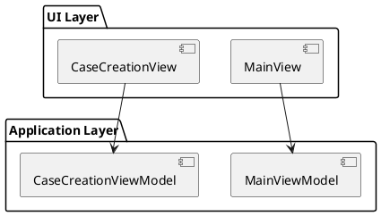

# Documentation Style Guide Protocol

**Version:** 2.1
**Last Updated:** 2026-01-03
**Purpose:** Technical documentation standards for dependency analysis, impact assessment, and architectural planning

---

## Critical Rules

### 1. Document ONLY What Actually Exists in Code

**PROHIBITED CONTENT:**
- Business value propositions, ROI calculations, cost savings
- Hypothetical user personas (unless based on actual user research data)
- Hypothetical user journeys or workflows (not observed)
- Marketing materials, competitive advantages, market positioning
- **Time estimates, effort estimates, migration estimates**
- **Complexity assessments without measurable criteria**
- Performance metrics not from code, tests, or monitoring
- "Could do" or "should do" - only "does do"

**REQUIRED CONTENT:**
- Actual implemented features with code references
- Technical architecture from code analysis
- Full stack traces (UI -> ViewModel -> Domain -> Repository -> Database)
- Integration patterns with actual API endpoints and data models
- Framework usage analysis (what is used, where, how)
- Complete data flow mappings with field-level detail
- Actual classes, methods, files, and line numbers

### 2. Every Claim Must Have a Code Reference

**Format:**
```markdown
**Feature:** Case creation workflow
**Implementation:**
- UI: `src/Views/CaseCreationView.xaml.cs:45-67`
- ViewModel: `src/ViewModels/CaseCreationViewModel.cs:123-189`
- Domain: `src/Domain/Entities/Case.cs:34-78`
- Repository: `src/Infrastructure/Repositories/CaseRepository.cs:234-255`
- Database: `AppData.db` -> `Cases` table
```

### 3. File Location Rules

**Documentation Location:**
- All documentation under `./docs/{ProjectName}/`
- Protocols under `./.claude/protocols/`
- Only README.md, CLAUDE.md, TODO.md at project root

---

## Directory Structure

```
project/
├── CLAUDE.md                              # Main guidance
├── .claude/protocols/                     # Documentation protocols
├── docs/
│   ├── {ProjectName}/                     # Per-project technical documentation
│   │   ├── README.md                      # Project overview with navigation
│   │   ├── glossary.md                    # Project-specific terminology
│   │   ├── dependencies.md                # Centralized dependency tracking
│   │   ├── sbom.md                        # Software Bill of Materials
│   │   │
│   │   ├── technical/                     # Technical architecture
│   │   │   ├── system-architecture.md     # C4 diagrams, components, deployment
│   │   │   ├── technology-stack.md        # Exact versions, packages
│   │   │   ├── data-architecture.md       # Database schema, models
│   │   │   └── communication-protocols.md # Binary protocols, message formats
│   │   │
│   │   ├── patterns/                      # Actual design patterns used
│   │   │   ├── architectural/             # High-level patterns
│   │   │   ├── design/                    # Code-level patterns
│   │   │   └── domain/                    # Domain-specific patterns
│   │   │
│   │   ├── features/                      # Implemented features
│   │   │   ├── README.md                  # Feature catalog
│   │   │   ├── feature-matrix.md          # Complete feature grid
│   │   │   └── {feature-name}.md          # Full stack trace per feature
│   │   │
│   │   ├── integrations/                  # External system integration
│   │   │   ├── README.md                  # Integration overview
│   │   │   └── {system}-integration.md    # Per-system integration docs
│   │   │
│   │   ├── data/                          # Complete data architecture
│   │   │   ├── database-schema.md         # Every table, field, FK, index
│   │   │   ├── data-flow-diagrams.md      # UI->VM->Domain->DB mappings
│   │   │   └── entity-relationship.md     # ER diagrams with PlantUML
│   │   │
│   │   ├── security/                      # Actual security implementation
│   │   │   ├── authentication.md          # Actual auth code
│   │   │   ├── authorization.md           # Actual RBAC implementation
│   │   │   └── data-protection.md         # Actual encryption code
│   │   │
│   │   └── ui/                            # UI structure and patterns
│   │       ├── ui-architecture.md         # MVVM/MVC implementation details
│   │       └── screen-catalog.md          # Every screen with diagrams
│   │
│   └── shared/                            # Cross-cutting analysis
│       ├── dependency-matrix.md           # What depends on what
│       ├── framework-usage-matrix.md      # Library usage across apps
│       └── integration-patterns.md        # Common integration approaches
```

---

## Critical Documentation Requirements

### 1. Full Stack Tracing

**Every feature MUST be documented with complete stack trace:**

```markdown
## Feature: Create New Case

### User Action
User clicks "File > New Recording" or presses Ctrl+N

### Call Stack

#### 1. UI Layer
**File:** `src/Views/MainView.xaml`
**Element:** MenuItem with Command binding
```xaml
<MenuItem Header="New Recording" Command="{Binding CreateCaseCommand}" />
```

#### 2. ViewModel Layer
**File:** `src/ViewModels/MainViewModel.cs:123-189`
```csharp
public ICommand CreateCaseCommand { get; }

private async Task CreateCaseAsync()
{
    // Line 130: Validate prerequisites
    // Line 145: Show patient selection dialog
    // Line 160: Call domain service
}
```

#### 3. Domain Layer
**File:** `src/Domain/Services/CaseService.cs:67-105`
```csharp
public async Task<Case> CreateCase(Patient patient, Template template)
{
    // Line 78: Validate business rules
    // Line 92: Create Case aggregate
}
```

#### 4. Repository Layer
**File:** `src/Infrastructure/Repositories/CaseRepository.cs:234-255`

#### 5. Database
**Database:** `AppData.db`
**Table:** `Cases`
**Fields:** CaseId, PatientId, ProcedureDate, Status, CreatedBy, CreatedDate
```

### 2. Integration Documentation

**For external system integrations:**

```markdown
## External System Integration Analysis

### API Endpoints Used

| Endpoint | Method | Purpose | Called From | Frequency |
|----------|--------|---------|-------------|-----------|
| `/api/v2/patients` | GET | Search patients | `PatientSearchViewModel.cs:45` | Per search |
| `/api/v2/cases` | POST | Create case | `CaseSyncService.cs:189` | Per case |

### Data Synchronization Patterns

**Sync Frequency:**
- Patient data: On-demand (user search)
- Case metadata: Immediate (on save)
- Reports: On completion only

**Offline Behavior:**
- Queues sync operations in `OfflineQueue` table
- Retries with exponential backoff
- Conflict resolution: Last-write-wins

### Impact of API Changes

**Breaking Changes Would Affect:**
- API endpoint URL changes -> Update `Configuration.cs`
- Authentication changes -> Update `AuthService.cs`
- Data model changes -> Update mapping in `ModelMapper.cs`
```

### 3. Dependencies and SBOM

**REQUIRED for ALL projects:** Create both `dependencies.md` and `sbom.md`.

#### dependencies.md Sections:
1. **Package Dependencies** - List ALL packages with versions
2. **Internal Dependencies** - Internal framework references
3. **Framework Dependencies** - System assemblies referenced
4. **Native Libraries** - C++ libraries, COM components
5. **External Services** - API integrations
6. **Dependency Graph** - Visual representation

#### sbom.md Sections:
1. **SBOM Overview** - Component count, scope
2. **Product Information** - Name, vendor, version
3. **Component Inventory** - Per component details
4. **License Summary** - License types breakdown
5. **Security Considerations** - Vulnerability management
6. **Supply Chain Risk Assessment** - Risk factors

---

## Documentation Validation Checklist

Before marking any documentation as complete, verify:

- [ ] **No hypothetical content** - Everything is from actual code
- [ ] **Code references** - Every claim has file:line references
- [ ] **Full stack traces** - Features documented UI->VM->Domain->Repo->DB
- [ ] **Integration details** - All API endpoints, sync patterns documented
- [ ] **Framework usage** - Library dependencies identified
- [ ] **Database complete** - All tables, fields, FKs, indexes documented
- [ ] **Data flow mapped** - UI field to DB column mapping complete
- [ ] **PlantUML diagrams** - Embedded with code references
- [ ] **Dependencies documented** - dependencies.md created
- [ ] **SBOM created** - sbom.md with component inventory
- [ ] **No marketing** - No ROI, business value claims
- [ ] **Impact analysis ready** - Document supports "what breaks if X changes"

---

## Markdown Standards

### Document Header

```markdown
# [Document Title]

**Last Updated:** YYYY-MM-DD
**Code Analysis Date:** YYYY-MM-DD
**Reference:** `{ProjectName}` @ `{branch}` (`{commit-hash}`)
**Purpose:** [One sentence: what decisions this doc supports]

## Table of Contents
[If document >100 lines]

## Overview
[2-3 sentences: what this document covers]
```

### Code Reference Format

```markdown
**File:** `Project/Folder/ClassName.cs:123-145`
```

Always include:
- Relative path from repository root
- Class or file name
- Line numbers (range for blocks, single for specific lines)

### PlantUML Diagrams

Embed diagrams directly:

```markdown
## Architecture Diagram


```

### Document Footer

```markdown
---

### Document Metadata

- **Document Prepared:** YYYY-MM-DD
- **Code Analysis Date:** YYYY-MM-DD
- **Reference:** `ProjectName` @ `branch` (`commit-hash`)
- **Documentation Purpose:** [One sentence]
- **Protocol Version:** 2.1
```

---

## Related Protocols

- [documentation-standards.md](./documentation-standards.md) - File organization
- [architectural-analysis.md](../software/architectural-analysis.md) - Analysis procedure
- [comprehensive-analysis-checklist.md](../software/comprehensive-analysis-checklist.md) - Completeness

---

## Change Log

- 2026-01-03 v2.1: Generalized for any project, added Dependencies/SBOM requirements
- 2026-01-02 v2.0: Technical documentation focus, removed business content
- 2026-01-02 v1.0: Initial version
