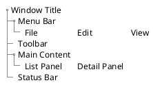

# Comprehensive Analysis Checklist

**Version:** 1.0
**Last Updated:** 2026-01-03
**Purpose:** Ensure complete documentation capturing all stakeholder perspectives

---

## Overview

This checklist ensures documentation captures all relevant perspectives for complete architectural understanding. Use it after completing the Architectural Analysis Protocol to verify completeness.

## When to Use

- After completing architectural analysis
- During documentation reviews
- Before finalizing v-next planning documents
- When validating documentation completeness

---

## Analysis Dimensions

### 1. Technical Architecture

**System Context:**
- [ ] System boundaries defined
- [ ] External actors identified
- [ ] External systems documented
- [ ] Communication patterns mapped

**Components:**
- [ ] Major components identified
- [ ] Component responsibilities documented
- [ ] Component interactions mapped
- [ ] Technology stack per component

**Technology Stack:**
- [ ] Languages and versions
- [ ] Frameworks and versions
- [ ] Libraries and dependencies
- [ ] Build tools
- [ ] Deployment targets

---

### 2. Design Patterns

**Architectural Patterns:**
- [ ] Layered architecture identified
- [ ] Microservices/monolith determined
- [ ] Event-driven patterns documented
- [ ] CQRS/Event Sourcing (if applicable)

**Design Patterns:**
- [ ] Repository pattern usage
- [ ] Factory pattern usage
- [ ] Strategy pattern usage
- [ ] Observer/Event patterns
- [ ] Dependency injection approach

**Domain Patterns:**
- [ ] Domain model structure
- [ ] Aggregate boundaries
- [ ] Value objects vs entities
- [ ] Domain events

**Code Organization:**
- [ ] Folder structure documented
- [ ] Naming conventions identified
- [ ] Module boundaries clear

**Testing Patterns:**
- [ ] Unit test organization
- [ ] Integration test approach
- [ ] Test data management
- [ ] Mocking strategies

---

### 3. User Experience

**Personas:**
- [ ] User roles identified (from code, not hypothetical)
- [ ] Role permissions documented
- [ ] User workflows traced in code

**UI Structure:**
- [ ] Screen catalog created
- [ ] Navigation patterns documented
- [ ] MVVM/MVC structure mapped
- [ ] Data binding patterns

**Accessibility:**
- [ ] Accessibility features identified
- [ ] Keyboard navigation support
- [ ] Screen reader compatibility

---

### 4. Security & Compliance

**Authentication:**
- [ ] Auth mechanism identified
- [ ] Token/session management
- [ ] Credential storage
- [ ] Auth code references

**Authorization:**
- [ ] RBAC implementation
- [ ] Permission model
- [ ] Data scoping rules
- [ ] Authorization code references

**Data Protection:**
- [ ] Encryption at rest
- [ ] Encryption in transit
- [ ] Key management
- [ ] Data protection code references

**Audit Logging:**
- [ ] Audit events captured
- [ ] Audit storage location
- [ ] Audit log format
- [ ] Audit code references

---

### 5. Data Architecture

**Data Model:**
- [ ] Entity relationship diagrams
- [ ] Database schema documented
- [ ] Field-level mappings (UI to DB)
- [ ] Data types and constraints

**Data Sources:**
- [ ] Primary database(s) identified
- [ ] External data sources
- [ ] Cache layers
- [ ] File storage

**Data Flow:**
- [ ] Data flow diagrams created
- [ ] Transformation rules documented
- [ ] Sync patterns identified
- [ ] Conflict resolution rules

**Data Lifecycle:**
- [ ] Data retention policies
- [ ] Archival processes
- [ ] Deletion procedures
- [ ] Backup strategies

---

### 6. Operations & Support

**Monitoring:**
- [ ] Logging implementation
- [ ] Metrics collection
- [ ] Health checks
- [ ] Alerting mechanisms

**Support:**
- [ ] Error handling patterns
- [ ] User-facing error messages
- [ ] Support documentation
- [ ] Troubleshooting guides

**Maintenance:**
- [ ] Update procedures
- [ ] Migration processes
- [ ] Configuration management
- [ ] Environment management

---

### 7. Communication Protocols

**Mechanisms:**
- [ ] REST APIs documented
- [ ] gRPC services
- [ ] Message queues
- [ ] WebSocket connections
- [ ] Binary protocols

**API Contracts:**
- [ ] OpenAPI/Swagger specs
- [ ] Protocol buffer definitions
- [ ] Message schemas
- [ ] Version management

**Data Formats:**
- [ ] JSON schemas
- [ ] XML schemas
- [ ] Binary formats
- [ ] Serialization approaches

**Integration Patterns:**
- [ ] Sync vs async patterns
- [ ] Retry strategies
- [ ] Circuit breaker patterns
- [ ] Offline handling

---

## Evidence Collection Requirements

### Code References

Every claim must have a code reference:
```markdown
**Feature:** [Name]
**File:** `path/to/file.cs:123-145`
**Evidence:** [Specific code or configuration that proves the claim]
```

### Field Mapping Tables

For data architecture:
| UI Field | ViewModel Property | Domain Property | DB Column | API Field |
|----------|-------------------|-----------------|-----------|-----------|
| [Label] | [Property] | [Property] | [Column] | [Field] |

### UI Layouts (SALT Diagrams)

For UI documentation:


---

## Completeness Scoring

Rate each dimension:

| Dimension | Complete | Partial | Missing |
|-----------|----------|---------|---------|
| Technical Architecture | [ ] | [ ] | [ ] |
| Design Patterns | [ ] | [ ] | [ ] |
| User Experience | [ ] | [ ] | [ ] |
| Security & Compliance | [ ] | [ ] | [ ] |
| Data Architecture | [ ] | [ ] | [ ] |
| Operations & Support | [ ] | [ ] | [ ] |
| Communication Protocols | [ ] | [ ] | [ ] |

**Minimum for Complete Analysis:** All dimensions at least "Partial"
**Recommended:** All dimensions "Complete"

---

## Related Protocols

- [Architectural Analysis](./architectural-analysis.md) - Analysis procedure
- [Documentation Style Guide](../documentation/documentation-style-guide.md) - Content standards
- [Protocol Validation](./protocol-validation.md) - Quality assurance

---

## Change Log

- 2026-01-03 v1.0: Generalized for any project
- 2026-01-02 v1.0: Initial comprehensive analysis checklist
