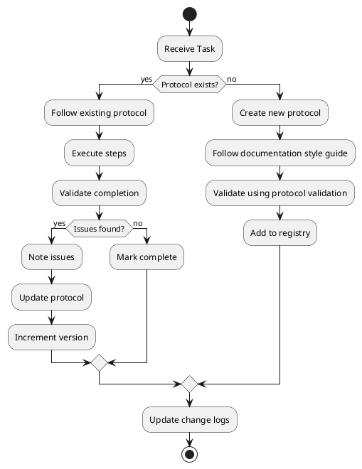

# Protocol Registry

**Last Updated:** 2026-01-02

## Overview

This directory contains reusable protocols for consistent documentation and analysis across the AllApps repository. Protocols define standardized procedures that can be executed and validated.

## Active Protocols

| Protocol | Version | Purpose | Last Updated |
|----------|---------|---------|--------------|
| [Documentation Style Guide](./documentation-style-guide.md) | 1.0 | Documentation standards, formatting, and structure for all stakeholder perspectives | 2026-01-02 |
| [Architectural Analysis](./architectural-analysis.md) | 1.0 | Systematic submodule architecture analysis | 2026-01-02 |
| [Protocol Validation](./protocol-validation.md) | 1.0 | Validate and update protocols | 2026-01-02 |
| [Comprehensive Analysis Checklist](./comprehensive-analysis-checklist.md) | 1.0 | Complete checklist for capturing all stakeholder perspectives | 2026-01-02 |

## Protocol Workflow

## Protocol Dependencies

- **Documentation Style Guide**: Foundation for all documentation
  - Required by: All other protocols

- **Architectural Analysis**: Architecture analysis procedure
  - Depends on: Documentation Style Guide
  - Used for: Analyzing submodule architecture

- **Protocol Validation**: Meta-protocol for protocol quality
  - Depends on: Documentation Style Guide
  - Used for: All protocols

## Creating New Protocols

When creating a new protocol:

1. **Follow the structure** defined in [Documentation Style Guide](./documentation-style-guide.md)
2. **Required sections**:
   - Version, Last Updated, Purpose (metadata)
   - Overview
   - When to Use
   - Prerequisites
   - Procedure (with numbered steps)
   - Validation Checklist
   - Common Issues (table)
   - Related Protocols
   - Change Log

3. **Validate** using [Protocol Validation](./protocol-validation.md)
4. **Update this registry** with new protocol information

## Review Schedule

- **New protocols**: Validate immediately after creation using Protocol Validation
- **Active protocols**: Quarterly review
- **After usage**: Update if issues discovered
- **Annual**: Comprehensive review of all protocols

## Protocol Usage

**Starting a New Project Analysis:**
1. Review [Documentation Style Guide](./documentation-style-guide.md) for standards
2. Follow [Architectural Analysis Protocol](./architectural-analysis.md) for systematic process
3. Use [Comprehensive Analysis Checklist](./comprehensive-analysis-checklist.md) to ensure completeness
4. Validate using [Protocol Validation](./protocol-validation.md)

**Documentation Structure:**
All project documentation goes in `docs/<ProjectName>/` with folders for:
- `technical/` - Technical architecture and engineering
- `patterns/` - Design and architectural patterns (granular, one per file)
- `business/` - Use cases, processes, value proposition
- `users/` - Personas, workflows, UI structure
- `security/` - Auth, authorization, compliance, audit
- `data/` - Data models, sources, flow, lifecycle
- `operations/` - Monitoring, support, troubleshooting

## Future Protocols

Planned protocols:
- [ ] Submodule Update Protocol (managing git submodule updates)
- [ ] Cross-Cutting Analysis Protocol (analyzing patterns across projects)
- [ ] Use Case Documentation Protocol (structured use case format)
- [ ] UI Documentation Protocol (SALT diagrams and workflows)
- [ ] Security Assessment Protocol (security analysis framework)

## Change Log

- 2026-01-02 v1.0: Initial protocol registry created
