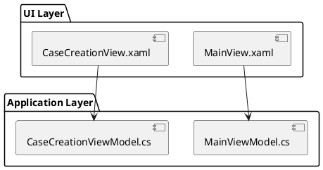

# Documentation Style Guide Protocol

**Version:** 2.1
**Last Updated:** 2026-01-03
**Purpose:** Technical documentation for dependency analysis, impact assessment, and v-next architectural planning

---

## ⚠️ CRITICAL RULES ⚠️

### 1. NEVER Create Files Within Submodules

**ABSOLUTE RULE:** All documentation must be created in the outer AllApps project, NEVER inside submodule directories.

**Correct Locations:**
- ✅ `.\docs\Cascade\` - Documentation about Cascade (CORRECT)
- ✅ `.\docs\Arc\` - Documentation about Arc (CORRECT)
- ✅ `.\docs\shared\` - Cross-project documentation (CORRECT)

**Incorrect Locations:**
- ❌ `Cascade\docs\` - Inside Cascade submodule (WRONG)
- ❌ `Arc\anything.md` - Inside Arc submodule (WRONG)

**If Mistake Occurs:**
1. Immediately move files to correct location: `.\docs\<ProjectName>\`
2. Clean submodule: `cd <submodule> && git clean -fd docs/`
3. Verify: `cd <submodule> && git status` should show no changes

### 2. Document ONLY What Actually Exists in Code

**PROHIBITED CONTENT:**
- ❌ Business value propositions, ROI calculations, cost savings
- ❌ Hypothetical user personas (unless based on actual user research data)
- ❌ Hypothetical user journeys or workflows (not observed)
- ❌ Marketing materials, competitive advantages, market positioning
- ❌ **Time estimates, effort estimates, migration estimates (e.g., "will take 2-3 weeks", "14-20 week migration")**
- ❌ **Complexity assessments without measurable criteria (e.g., "HIGH RISK", "MEDIUM COMPLEXITY")**
- ❌ Performance metrics not from code, tests, or monitoring
- ❌ "Could do" or "should do" - only "does do"

**REQUIRED CONTENT:**
- ✅ Actual implemented features with code references
- ✅ Technical architecture from code analysis
- ✅ Full stack traces (UI → ViewModel → Domain → Repository → Database)
- ✅ Integration patterns with actual API endpoints and data models
- ✅ Framework usage analysis (what is used, where, how)
- ✅ Complete data flow mappings with field-level detail
- ✅ Actual classes, methods, files, and line numbers

### 3. Every Claim Must Have a Code Reference

**Format:**
```markdown
**Feature:** Case creation workflow
**Implementation:**
- UI: `Cascade.UI/Views/CaseCreationView.xaml.cs:45-67`
- ViewModel: `Cascade.Application/ViewModels/CaseCreationViewModel.cs:123-189`
- Domain: `Cascade.Domain/Entities/Case.cs:34-78`
- Repository: `Cascade.Infrastructure/Repositories/CaseRepository.cs:234-255`
- Database: `IOMRecord.db` → `Cases` table (fields: CaseId, PatientId, ProcedureDate, Status, CreatedBy, CreatedDate)
```

---

## Documentation Purpose

This repository documents the **technical architecture** of Cadwell applications for:

1. **V-Next Planning**: Understanding CadLink v-next impact on all consuming applications
2. **Dependency Analysis**: What integrations exist, how they're used, where they're used
3. **Framework Usage**: How Core library is used across applications
4. **Overlap Analysis**: Common patterns, shared functionality across applications
5. **Impact Assessment**: Understanding change ripple effects across the ecosystem

**Primary Use Case:** "I need to redesign CadLink - what will break and where?"

---

## Directory Structure

```
AllApps/
├── CLAUDE.md                                    # Main guidance
├── .claude/protocols/                           # Documentation protocols
├── docs/
│   ├── <ProjectName>/                           # Per-project technical documentation
│   │   ├── README.md                            # Project overview with navigation
│   │   ├── glossary.md                          # Project-specific terminology
│   │   ├── dependencies.md                      # Centralized dependency tracking
│   │   ├── sbom.md                              # Software Bill of Materials
│   │   │
│   │   ├── technical/                           # Technical architecture
│   │   │   ├── README.md
│   │   │   ├── system-architecture.md           # C4 diagrams, components, deployment
│   │   │   ├── technology-stack.md              # Exact versions, NuGet packages
│   │   │   ├── data-architecture.md             # Database schema, EF models
│   │   │   ├── communication-protocols.md       # Binary protocols, message formats
│   │   │   └── data-schemas.md                  # JSON/XML schemas, contracts
│   │   │
│   │   ├── patterns/                            # Actual design patterns used
│   │   │   ├── README.md                        # Pattern catalog
│   │   │   ├── architectural/                   # High-level patterns
│   │   │   ├── design/                          # Code-level patterns
│   │   │   └── domain/                          # Domain-specific patterns
│   │   │   # Each pattern file MUST include code references
│   │   │
│   │   ├── features/                            # Implemented features (NOT "business")
│   │   │   ├── README.md                        # Feature catalog
│   │   │   ├── feature-matrix.md                # Complete feature grid
│   │   │   └── <feature-name>.md                # Full stack trace per feature
│   │   │   # Each feature MUST trace: UI → VM → Domain → Repo → DB → Integration
│   │   │
│   │   ├── integrations/                        # External system integration deep dives
│   │   │   ├── README.md                        # Integration overview
│   │   │   ├── cadlink-integration.md           # CRITICAL: CadLink API usage
│   │   │   ├── cloudeeg-integration.md          # CloudEEG integration
│   │   │   ├── core-library-usage.md            # Core framework dependencies
│   │   │   └── hardware-integration.md          # CPIN/hardware protocols
│   │   │   # MUST document: APIs used, data synced, auth, offline behavior
│   │   │
│   │   ├── data/                                # Complete data architecture
│   │   │   ├── README.md
│   │   │   ├── database-schema.md               # Every table, field, FK, index
│   │   │   ├── data-flow-diagrams.md            # UI→VM→Domain→DB mappings
│   │   │   ├── entity-relationship.md           # ER diagrams with PlantUML
│   │   │   └── data-sync-patterns.md            # How data moves between systems
│   │   │
│   │   ├── security/                            # Actual security implementation
│   │   │   ├── README.md
│   │   │   ├── authentication.md                # Actual auth code
│   │   │   ├── authorization.md                 # Actual RBAC implementation
│   │   │   ├── data-protection.md               # Actual encryption code
│   │   │   └── audit-logging.md                 # Actual audit implementation
│   │   │   # MUST include code references, not compliance claims
│   │   │
│   │   └── ui/                                  # UI structure and patterns
│   │       ├── README.md
│   │       ├── ui-architecture.md               # MVVM implementation details
│   │       ├── screen-catalog.md                # Every screen with SALT diagrams
│   │       └── ui-data-binding.md               # XAML bindings to ViewModels
│   │
│   └── shared/                                  # Cross-cutting analysis
│       ├── README.md
│       ├── dependency-matrix.md                 # What depends on what
│       ├── framework-usage-matrix.md            # Core library usage across apps
│       ├── integration-patterns.md              # Common integration approaches
│       └── overlap-analysis.md                  # Shared functionality analysis
```

---

## Critical Documentation Requirements

### 1. Full Stack Tracing

**Every feature MUST be documented with complete stack trace:**

```markdown
## Feature: Create New Case

### User Action
User clicks "File > New Recording" or presses Ctrl+N

### Call Stack

#### 1. UI Layer
**File:** `Cascade.UI/Views/MainView.xaml`
**Element:** MenuItem with Command binding
```xaml
<MenuItem Header="New Recording" Command="{Binding CreateCaseCommand}" />
```

**File:** `Cascade.UI/Views/MainView.xaml.cs:45`
```csharp
// Command binding in MainViewModel
```

#### 2. ViewModel Layer
**File:** `Cascade.Application/ViewModels/MainViewModel.cs:123-189`
```csharp
public ICommand CreateCaseCommand { get; }

private async Task CreateCaseAsync()
{
    // Line 130: Validate prerequisites
    // Line 145: Show patient selection dialog
    // Line 160: Call domain service
}
```

#### 3. Domain Layer
**File:** `Cascade.Domain/Services/CaseService.cs:67-105`
```csharp
public async Task<Case> CreateCase(Patient patient, Template template)
{
    // Line 78: Validate business rules
    // Line 92: Create Case aggregate
    // Line 105: Raise CaseCreatedEvent
}
```

#### 4. Repository Layer
**File:** `Cascade.Infrastructure/Repositories/CaseRepository.cs:234-255`
```csharp
public async Task<int> SaveAsync(Case case)
{
    // Line 240: Map domain entity to EF entity
    // Line 250: DbContext.SaveChanges()
}
```

#### 5. Database
**Database:** `IOMRecord.db`
**Table:** `Cases`
**Fields:**
- `CaseId` (INTEGER PRIMARY KEY)
- `PatientId` (INTEGER FOREIGN KEY → Patients.PatientId)
- `ProcedureDate` (DATETIME NOT NULL)
- `Status` (TEXT CHECK(Status IN ('Active','Completed','Archived')))
- `CreatedBy` (TEXT NOT NULL)
- `CreatedDate` (DATETIME DEFAULT CURRENT_TIMESTAMP)

#### 6. Integration
**File:** `Cascade.CadLink/Services/CaseSyncService.cs:189-210`
**API:** `POST https://cadlink.hospital.local/api/v2/cases`
**Payload:**
```json
{
  "caseId": "guid",
  "patientId": "guid",
  "procedureDate": "2026-01-02T14:30:00Z",
  "status": "Active"
}
```
```

### 2. Integration Deep Dives & V-Next Impact Analysis

**For v-next impact analysis, document SCOPE not ESTIMATES:**

**✅ CORRECT - Document what exists and what would need to change:**
- "These 47 files use the Entity.Repo pattern"
- "Database sync happens in these 12 classes: [list with code refs]"
- "If authentication changes, these components are affected: [list]"
- "Migration would require changes to: repositories, DataWarehouse, SyncService"
- "Breaking changes would affect: [list of files and line numbers]"

**❌ INCORRECT - Do not estimate time or effort:**
- "Migration will take 14-20 weeks" ❌
- "Estimated effort: 2-3 days" ❌
- "High complexity" ❌ (unless you can measure complexity objectively)
- "Should take about a month" ❌

**For CadLink integration (CRITICAL for v-next):**

```markdown
## CadLink Integration Analysis

### API Endpoints Used

| Endpoint | Method | Purpose | Called From | Frequency |
|----------|--------|---------|-------------|-----------|
| `/api/v2/patients` | GET | Search patients | `PatientSearchViewModel.cs:45` | Per search |
| `/api/v2/patients/{id}` | GET | Load patient details | `PatientRepository.cs:123` | Per case creation |
| `/api/v2/cases` | POST | Create case | `CaseSyncService.cs:189` | Per case |
| `/api/v2/cases/{id}` | PUT | Update case | `CaseSyncService.cs:234` | Per save |
| `/api/v2/cases/{id}/waveforms` | POST | Upload waveforms | `WaveformSyncService.cs:567` | Every 30s |

### Data Synchronization Patterns

**Sync Frequency:**
- Patient data: On-demand (user search)
- Case metadata: Immediate (on save)
- Waveform data: Every 30 seconds (background)
- Reports: On completion only

**Offline Behavior:**
- Queues sync operations in `OfflineQueue` table
- Retries with exponential backoff
- Conflict resolution: Last-write-wins

**Authentication:**
- OAuth 2.0 Client Credentials flow
- Token refresh every 50 minutes
- Stored in `CredentialManager` (Windows)

### Impact of CadLink v-Next Changes

**Breaking Changes:**
- API endpoint URL changes → Update `CadLinkConfiguration.cs`
- Authentication changes → Update `CadLinkAuthService.cs`
- Data model changes → Update mapping in `CadLinkModelMapper.cs`

**Data Migration Needed If:**
- Patient ID format changes
- Case status values change
- Required fields added
```

### 3. Framework Usage Analysis

```markdown
## Core Library Usage

### UI Controls Used

| Control | Usage Location | Purpose |
|---------|----------------|---------|
| `Core.UI.Controls.LoadingSpinner` | `MainView.xaml:234` | Loading indicator |
| `Core.UI.Controls.ValidationTextBox` | `PatientEditView.xaml:45` | Input validation |
| `Core.UI.Behaviors.FocusBehavior` | `CaseCreationView.xaml:67` | Focus management |

### Services Used

| Service | Implementation | Usage |
|---------|----------------|-------|
| `Core.Licensing.LicenseValidator` | `App.xaml.cs:89` | License check on startup |
| `Core.Logging.ILogger` | Throughout app | Structured logging |
| `Core.Configuration.IConfigurationService` | `Startup.cs:45` | App settings |

### Impact of Core Library Changes

**If Core.UI.Controls removed:**
- Replace 47 instances of LoadingSpinner
- Replace 123 instances of ValidationTextBox
- Reimplement FocusBehavior (12 usages)
```

### 4. Database Schema Documentation

```markdown
## Database Schema: IOMRecord.db

### Tables

#### Cases Table
```sql
CREATE TABLE Cases (
    CaseId INTEGER PRIMARY KEY AUTOINCREMENT,
    PatientId INTEGER NOT NULL,
    ProcedureDate DATETIME NOT NULL,
    Status TEXT NOT NULL CHECK(Status IN ('Active','Completed','Archived')),
    TemplateId INTEGER,
    SurgeonName TEXT,
    CreatedBy TEXT NOT NULL,
    CreatedDate DATETIME DEFAULT CURRENT_TIMESTAMP,
    ModifiedBy TEXT,
    ModifiedDate DATETIME,
    SyncedToCadLink BOOLEAN DEFAULT 0,
    CadLinkCaseId TEXT,
    FOREIGN KEY (PatientId) REFERENCES Patients(PatientId),
    FOREIGN KEY (TemplateId) REFERENCES Templates(TemplateId)
);

CREATE INDEX IX_Cases_PatientId ON Cases(PatientId);
CREATE INDEX IX_Cases_ProcedureDate ON Cases(ProcedureDate);
CREATE INDEX IX_Cases_Status ON Cases(Status);
CREATE INDEX IX_Cases_SyncedToCadLink ON Cases(SyncedToCadLink);
```

**Entity Framework Mapping:**
**File:** `Cascade.Infrastructure/Data/Configurations/CaseConfiguration.cs:15-45`
```csharp
public void Configure(EntityTypeBuilder<Case> builder)
{
    builder.ToTable("Cases");
    builder.HasKey(c => c.CaseId);
    builder.Property(c => c.Status).IsRequired().HasConversion<string>();
    // ...
}
```

### Field-Level Data Flow

| UI Field | ViewModel Property | Domain Property | DB Column | CadLink API Field |
|----------|-------------------|-----------------|-----------|-------------------|
| Procedure Date picker | `CaseCreationViewModel.ProcedureDate` | `Case.ProcedureDate` | `Cases.ProcedureDate` | `procedureDate` |
| Surgeon Name textbox | `CaseCreationViewModel.SurgeonName` | `Case.SurgeonName` | `Cases.SurgeonName` | `surgeonName` |
```

### 5. Dependencies and Software Bill of Materials (SBOM)

**REQUIRED for ALL projects:** Create both `dependencies.md` and `sbom.md` at project root level.

#### dependencies.md - Centralized Dependency Tracking

```markdown
# Dependencies - Centralized Dependency Tracking

**Purpose:** Track ALL dependencies for v-next planning, security audits, and migration impact analysis

### Required Sections:

1. **NuGet Packages**
   - List ALL packages from Directory.Packages.props or packages.config
   - Include: Name, Version, Purpose, License, V-Next Impact
   - Source: Actual .csproj or .props files

2. **Internal Dependencies** (e.g., Cadwell.Core)
   - List all internal framework projects referenced
   - Document usage statistics (e.g., "DelegateCommand: 1,441 usages across 211 files")
   - Include code references for key usages

3. **.NET Framework Dependencies**
   - List all System.* assemblies referenced
   - Document v-next compatibility (e.g., "Not available in .NET 8")

4. **Native Libraries**
   - Document all C++ libraries, COM components, P/Invoke dependencies
   - Include: Platform requirements, license, v-next compatibility

5. **Hardware Dependencies** (if applicable)
   - Document hardware platforms, protocols, drivers
   - Include: Communication protocols, platform requirements

6. **External Services**
   - Document all external API integrations
   - Include: Purpose, protocol, authentication, v-next impact

7. **Dependency Graph**
   - Visual representation of dependency chains
   - Critical dependency paths highlighted

8. **V-Next Migration Impact**
   - Per-dependency impact analysis
   - HIGH/MEDIUM/LOW impact classification with justification
   - Components affected (list files/classes, NOT time estimates)

**Code Reference Requirements:**
- All package versions MUST reference actual .csproj/.props files
- Usage counts MUST be verifiable (via grep/search)
- Never estimate complexity or time - only document scope
```

#### sbom.md - Software Bill of Materials

```markdown
# Software Bill of Materials (SBOM)

**Purpose:** Component inventory for security audits, license compliance, supply chain risk management

**Format:** SPDX-like or CycloneDX-like structure in Markdown

### Required Sections:

1. **SBOM Overview**
   - SBOM format/specification reference
   - Component count summary
   - Scope definition

2. **Product Information**
   - Product name, vendor, version
   - Platform, target framework
   - Build system, package manager

3. **Component Inventory** (PER COMPONENT):
   - Component Name
   - Version (exact version from code)
   - Vendor/Supplier
   - License (exact license type)
   - Package URL (PURL format: pkg:nuget/PackageName@Version)
   - Homepage/Repository URL
   - Purpose/Description
   - Distribution method
   - Build-time vs Runtime dependency
   - Security notes

4. **License Summary**
   - License types breakdown
   - Component count per license
   - Compliance requirements per license
   - Attribution requirements

5. **Security Considerations**
   - Vulnerability management process
   - Known vulnerabilities (if any)
   - EOL components tracking
   - Security update procedures

6. **Supply Chain Risk Assessment**
   - High/Medium/Low risk dependencies
   - Risk factors per dependency
   - Mitigation strategies
   - Critical dependencies (single points of failure)

**PURL Format:**
- NuGet: `pkg:nuget/DevExpress.Wpf.Grid@25.1.7`
- .NET: `pkg:dotnet/System.ServiceModel@4.8.0`
- Native: `pkg:generic/Intel-IPP@version`

**License Accuracy:**
- Verify licenses from actual package metadata or vendor documentation
- Do NOT guess licenses
- Flag unknown licenses for manual verification
```

---

## Documentation Validation Checklist

Before marking any documentation as complete, verify:

- [ ] **No hypothetical content** - Everything is from actual code
- [ ] **Code references** - Every claim has file:line references
- [ ] **Full stack traces** - Features documented UI→VM→Domain→Repo→DB→Integration
- [ ] **Integration details** - All API endpoints, sync patterns, auth documented
- [ ] **Framework usage** - Core library dependencies identified
- [ ] **Database complete** - All tables, fields, FKs, indexes documented
- [ ] **Data flow mapped** - UI field to DB column mapping complete
- [ ] **PlantUML diagrams** - Embedded (not separate files), with code references
- [ ] **Dependencies documented** - dependencies.md created with all NuGet, internal, external dependencies
- [ ] **SBOM created** - sbom.md created with complete component inventory and licenses
- [ ] **No marketing** - No ROI, business value, competitive advantage
- [ ] **Impact analysis ready** - Document supports "what breaks if X changes"

---

## Markdown Standards

### Proper Header Usage

**Use markdown headers (###, ####) for section titles, NOT bold labels:**

```markdown
❌ WRONG (bold labels for sections):
**MUST REPLACE:**
- Item 1
- Item 2

**MAY KEEP:**
- Item 3
```

```markdown
✅ CORRECT (proper headers):
#### MUST REPLACE

- Item 1
- Item 2

#### MAY KEEP

- Item 3
```

**Rule of thumb:**
- **Term definitions:** Use `- **Label:** value` (bulleted bold labels)
- **Section headings:** Use `#### Section Name` (proper headers)
- **Subsections under a header:** Use next-level header (####, #####)

### Document Header

```markdown
# [Document Title]

**Last Updated:** YYYY-MM-DD
**Code Analysis Date:** YYYY-MM-DD
**Submodule Reference:** `<ProjectName>` @ `<branch>` (`<commit-hash>`)
**Purpose:** [One sentence: what decisions this doc supports]

## Table of Contents
[If document >100 lines]

## Overview
[2-3 sentences: what this document covers]
```

### Code Reference Format

```markdown
**File:** `Project/Folder/ClassName.cs:123-145`
```

Always include:
- Relative path from repository root
- Class or file name
- Line numbers (range for blocks, single for specific lines)

### PlantUML Diagrams

Embed diagrams directly:

```markdown
## Architecture Diagram


```

### Document Footer

**REQUIRED FORMAT:** Use proper markdown headers and bulleted lists for footer metadata.

```markdown
---

### Document Metadata

- **Document Prepared:** YYYY-MM-DD
- **Code Analysis Date:** YYYY-MM-DD (if different from Document Prepared)
- **Submodule Reference:** `ProjectName` @ `branch` (`commit-hash`) (if applicable)
- **Documentation Purpose:** [One sentence explaining what decisions this doc supports]
- **Protocol Version:** 2.1 (technical documentation for impact analysis)
- **SBOM Version:** X.X (for SBOM documents only)
```

**DO NOT use separate paragraph format or bold labels for headers:**
```markdown
❌ WRONG (separate paragraphs):
**Document Prepared:** 2026-01-03
**Documentation Purpose:** Component inventory

❌ WRONG (bold label instead of header):
**Document metadata:**
- **Document Prepared:** 2026-01-03
```

**Use proper header with bulleted list:**
```markdown
✅ CORRECT:
### Document Metadata

- **Document Prepared:** 2026-01-03
- **Documentation Purpose:** Component inventory for security audits
- **Protocol Version:** 2.1
```

---

## Change Log
- 2026-01-03 v2.1: Added Dependencies and SBOM requirements, Document Footer formatting standard
- 2026-01-02 v2.0: Complete rewrite - focus on technical documentation for impact analysis, removed all hypothetical/business content requirements
- 2026-01-02 v1.2: Added file location rules
- 2026-01-02 v1.0: Initial version
