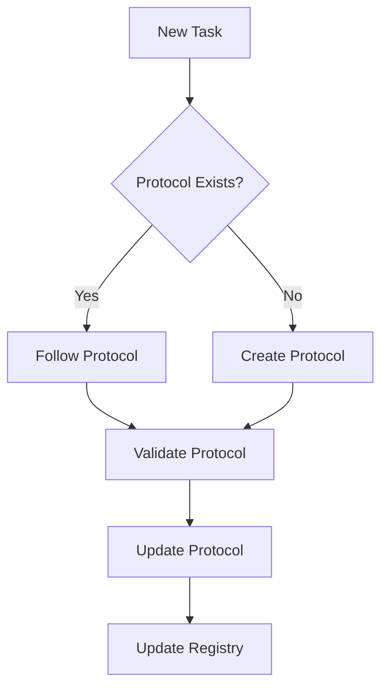

# Protocol Validation Protocol

**Version:** 1.0
**Last Updated:** 2026-01-02
**Purpose:** Ensure all protocols meet quality standards and remain up-to-date through usage.

## Overview

This meta-protocol defines how to validate, update, and maintain protocols themselves. It ensures protocols remain accurate, useful, and consistent with actual practices.

## When to Use

- After creating a new protocol
- After completing a task using a protocol
- When a protocol proves inadequate or incorrect
- During periodic protocol reviews (quarterly)
- When patterns in usage suggest protocol improvements

## Prerequisites

- [ ] Protocol exists in `.claude/protocols/`
- [ ] [Documentation Style Guide](./documentation-style-guide.md) available

## Procedure

### Step 1: Structural Validation

Verify protocol follows standard structure.

**Required Sections:**
- [ ] Title with "Protocol" suffix
- [ ] Metadata block (Version, Last Updated, Purpose)
- [ ] Overview section
- [ ] When to Use section
- [ ] Prerequisites section
- [ ] Procedure section with numbered steps
- [ ] Validation Checklist section
- [ ] Common Issues table
- [ ] Related Protocols section
- [ ] Change Log section

**Validation Commands:**
```bash
# Check for required sections
protocol_file=".claude/protocols/<protocol-name>.md"
grep -q "^## Overview" "$protocol_file" && echo "✓ Overview" || echo "✗ Missing Overview"
grep -q "^## When to Use" "$protocol_file" && echo "✓ When to Use" || echo "✗ Missing When to Use"
grep -q "^## Prerequisites" "$protocol_file" && echo "✓ Prerequisites" || echo "✗ Missing Prerequisites"
grep -q "^## Procedure" "$protocol_file" && echo "✓ Procedure" || echo "✗ Missing Procedure"
grep -q "^## Validation Checklist" "$protocol_file" && echo "✓ Validation Checklist" || echo "✗ Missing Validation Checklist"
grep -q "^## Common Issues" "$protocol_file" && echo "✓ Common Issues" || echo "✗ Missing Common Issues"
grep -q "^## Change Log" "$protocol_file" && echo "✓ Change Log" || echo "✗ Missing Change Log"
```

### Step 2: Content Quality Check

Assess protocol usefulness and clarity.

**Clarity Questions:**
- [ ] Is the purpose clear in one sentence?
- [ ] Are prerequisites specific and verifiable?
- [ ] Are procedure steps actionable?
- [ ] Does each step have validation criteria?
- [ ] Are examples provided where helpful?
- [ ] Is technical terminology explained or referenced?

**Completeness Questions:**
- [ ] Does it cover the entire workflow?
- [ ] Are common edge cases addressed?
- [ ] Are error conditions documented?
- [ ] Are validation points sufficient?
- [ ] Are related protocols linked?

**Accuracy Questions:**
- [ ] Do commands execute without errors?
- [ ] Are file paths correct?
- [ ] Are tool names and versions accurate?
- [ ] Do code examples work?

### Step 3: Usage Validation

Test protocol through actual use.

**Execution Test:**
1. Follow protocol exactly as written
2. Note any:
   - Unclear instructions
   - Missing steps
   - Incorrect commands
   - Insufficient validation points
   - Better approaches discovered

**Record Findings:**
```markdown
## Usage Test - [Date]

**Tester:** [Name/Role]
**Context:** [What task was being performed]

### Issues Found:
1. [Issue description]
   - Location: [Section/Step]
   - Severity: [Critical | Major | Minor]
   - Suggested Fix: [How to fix]

### Improvements Identified:
1. [Improvement description]
   - Benefit: [Why this helps]
   - Implementation: [How to add]
```

**Validation:**
- [ ] Protocol executed from start to finish
- [ ] All validation checkpoints passed
- [ ] No missing steps discovered
- [ ] No incorrect information found

### Step 4: Style Guide Compliance

Verify protocol follows documentation standards.

**Formatting:**
- [ ] Markdown formatting correct
- [ ] Code blocks have language identifiers
- [ ] Tables properly formatted
- [ ] Lists use consistent style
- [ ] Headings follow hierarchy

**Standards:**
- [ ] Active voice used for instructions
- [ ] Imperative mood for commands
- [ ] Consistent terminology
- [ ] Acronyms defined on first use
- [ ] File paths use correct format

**Metadata:**
- [ ] Version follows semantic versioning (X.Y)
- [ ] Last Updated is current date (YYYY-MM-DD)
- [ ] Purpose is concise (one sentence)
- [ ] Change log is updated

### Step 5: Cross-Reference Validation

Ensure protocol integrates with others.

**Link Validation:**
```bash
# Extract all markdown links
grep -o '\[.*\](.*\.md)' .claude/protocols/<protocol-name>.md

# Verify each linked file exists
# (Manual check or script)
```

- [ ] All referenced protocols exist
- [ ] All file paths are correct
- [ ] Related protocols are linked
- [ ] No circular dependencies create confusion

**Dependency Check:**
- [ ] Prerequisites reference existing protocols/tools
- [ ] Related protocols are listed
- [ ] Protocol fits into workflow with others

### Step 6: Update Protocol Based on Findings

Incorporate improvements discovered during validation.

**Version Update Rules:**

**Major Version Change (X.0):**
- Procedure steps reordered
- Steps added/removed
- Breaking changes to workflow
- Prerequisites change significantly

**Minor Version Change (X.Y):**
- Clarifications added
- Examples added/improved
- Common issues added
- Validation points refined
- Typos/formatting fixed

**Update Process:**
1. Make necessary changes
2. Update "Last Updated" date
3. Increment version appropriately
4. Add entry to Change Log:
   ```markdown
   - YYYY-MM-DD vX.Y: [Brief description of changes]
   ```

**Validation:**
- [ ] Changes address identified issues
- [ ] Version incremented correctly
- [ ] Last Updated date current
- [ ] Change log updated
- [ ] No new issues introduced

### Step 7: Peer Review (Optional)

For critical or complex protocols, request review.

**Review Checklist:**
- [ ] Protocol purpose is clear
- [ ] Procedure is complete and correct
- [ ] Validation points are sufficient
- [ ] Examples are helpful
- [ ] Common issues are relevant
- [ ] Style guide compliance verified

**Feedback Integration:**
- [ ] Review feedback collected
- [ ] Changes made based on feedback
- [ ] Reviewer acknowledged (optional)

### Step 8: Protocol Registry Update

Maintain central protocol registry.

Create/update `.claude/protocols/README.md`:

```markdown
# Protocol Registry

**Last Updated:** YYYY-MM-DD

## Active Protocols

| Protocol | Version | Purpose | Last Updated |
|----------|---------|---------|--------------|
| [Documentation Style Guide](./documentation-style-guide.md) | 1.0 | Documentation standards | 2026-01-02 |
| [Architectural Analysis](./architectural-analysis.md) | 1.0 | Analyze submodule architecture | 2026-01-02 |

## Protocol Workflow



## Protocol Dependencies

- **Documentation Style Guide**: Foundation for all documentation protocols
- **Architectural Analysis**: Depends on Documentation Style Guide
- **Protocol Validation**: Meta-protocol for all protocols

## Contributing

When creating new protocols:
1. Follow [Documentation Style Guide](./documentation-style-guide.md)
2. Use existing protocols as templates
3. Validate using [Protocol Validation](./protocol-validation.md)
4. Update this registry
```

**Validation:**
- [ ] Registry updated with protocol information
- [ ] Version and date current
- [ ] Dependencies documented if applicable

## Validation Checklist

Complete protocol validation:

- [ ] All required sections present
- [ ] Content is clear, complete, and accurate
- [ ] Protocol executed successfully (usage test)
- [ ] Style guide compliance verified
- [ ] Cross-references validated
- [ ] Protocol updated based on findings
- [ ] Version and change log updated
- [ ] Protocol registry updated
- [ ] No outstanding issues

## Common Issues

| Issue | Cause | Resolution |
|-------|-------|------------|
| Protocol too vague | Insufficient detail | Add specific examples and validation points |
| Protocol too prescriptive | Over-specification | Focus on outcomes, allow flexibility in approach |
| Commands don't work | Untested or environment-specific | Test in multiple contexts, add prerequisites |
| Missing validation | Incomplete procedure | Add checkpoint after each significant step |
| Outdated information | Tools/processes changed | Regular review schedule, update as needed |
| Circular dependencies | Protocols reference each other | Restructure, create foundational protocol |
| Inconsistent terminology | Multiple authors/versions | Establish glossary, enforce in style guide |

## Related Protocols

- [Documentation Style Guide](./documentation-style-guide.md) - Formatting and style standards
- [Protocol Creation Protocol](./protocol-creation.md) - How to create new protocols
- All other protocols (this validates all)

## Change Log

- 2026-01-02 v1.0: Initial protocol validation protocol created

## Notes

**Review Schedule:**
- New protocols: Validate immediately after creation
- Active protocols: Quarterly review
- After significant usage: Validate when issues discovered
- Annual: Comprehensive review of all protocols

**Quality Metrics:**
- **Completeness**: Can task be completed using only the protocol?
- **Clarity**: Can someone unfamiliar execute the protocol?
- **Accuracy**: Do all commands/examples work as stated?
- **Consistency**: Does it align with other protocols and standards?
