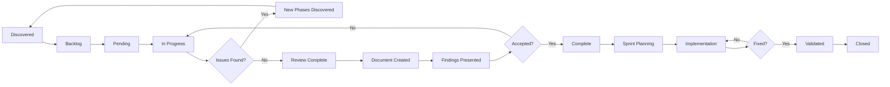

# CadLink Code Review Protocol

**Version**: 1.2
**Last Updated**: 2025-10-15
**Owner**: Development Team Lead / Code Review Coordinator

---

## Purpose

This protocol establishes a systematic, extensible process for conducting comprehensive code reviews of the CadLink medical data management system. The process ensures:

1. **Continuous Discovery**: New issues and review areas are identified and added dynamically
2. **Prioritization**: Critical issues are addressed first based on risk and impact
3. **Traceability**: All reviews are documented and tracked in TODO.md
4. **Consistency**: All reviews follow the same structure and quality standards
5. **Accountability**: Clear ownership and completion criteria

---

## Table of Contents

1. [Overview](#1-overview)
2. [TODO.md Management](#2-todomd-management)
3. [Phase Lifecycle](#3-phase-lifecycle)
4. [Discovery Process](#4-discovery-process)
5. [Prioritization Framework](#5-prioritization-framework)
6. [Review Document Template](#6-review-document-template)
7. [Quality Standards](#7-quality-standards)
8. [Sprint Integration](#8-sprint-integration)
9. [Completion Criteria](#9-completion-criteria)
10. [Continuous Improvement](#10-continuous-improvement)

---

## 1. Overview

### 1.1 Code Review Objectives

The CadLink code review process aims to:

- **Identify Security Vulnerabilities**: Authentication, authorization, encryption, session management
- **Ensure HIPAA Compliance**: PHI protection, audit logging, access controls, data retention
- **Detect Performance Issues**: Memory leaks, inefficient queries, blocking operations, resource exhaustion
- **Improve Code Quality**: Anti-patterns, technical debt, maintainability issues
- **Validate Architecture**: Design patterns, dependencies, coupling, scalability
- **Ensure Reliability**: Error handling, exception management, data integrity

### 1.2 Review Scope

**In Scope**:
- Source code in `/current/src/Source/`
- Internal tools in `/current/src/InternalTools/`
- Test code in `/current/src/Test/`
- Documentation in `/current/src/docs/`
- Build and deployment scripts

**Out of Scope** (unless specific issues discovered):
- Third-party dependencies (DevExpress, AWS SDK, NHapi)
- Generated code (Designer.cs files)
- Legacy archived code
- Database schema files (reviewed separately)

### 1.3 Review Team Roles

| Role | Responsibilities |
|------|------------------|
| **Code Review Coordinator** | Manages TODO.md, prioritizes phases, assigns reviews |
| **Security Reviewer** | Conducts security-focused phases, validates fixes |
| **HIPAA Compliance Officer** | Reviews audit logs, PHI handling, compliance gaps |
| **Performance Engineer** | Analyzes performance issues, validates optimizations |
| **Senior Developer** | General code quality reviews, architecture validation |
| **Product Owner** | Prioritizes fixes based on business impact |

---

## 2. TODO.md Management

### 2.1 TODO.md Structure

The `docs/code-review/TODO.md` file is the **single source of truth** for all code review activities. It must follow this structure:

```markdown
# Code Review Progress Tracking

**Last Updated**: YYYY-MM-DD
**Overall Progress**: X/Y phases complete (Z%)
**Current Sprint**: Sprint N
**Review Coordinator**: [Name]

---

## Phase Status Legend

- ✅ **Complete** - Review finished, document created, findings addressed
- 🔄 **In Progress** - Review actively being conducted
- 📋 **Pending** - Queued for review, not started
- ⏸️ **Blocked** - Waiting on dependencies or decisions
- 🔴 **Critical** - High priority, security/compliance risk
- 🟠 **High** - Important, significant technical debt
- 🟡 **Medium** - Moderate priority, quality improvement
- 🟢 **Low** - Nice-to-have, optimization opportunity

---

## Active Review Phases

### Current Sprint (Sprint N)

#### Phase X: [Phase Name] [Priority Icon]
**Status**: [Status Icon] [Status Text]
**Priority**: P0/P1/P2/P3
**Assigned To**: [Reviewer Name]
**Started**: YYYY-MM-DD
**Target Completion**: YYYY-MM-DD
**Document**: `XX-phase-name.md`

**Objectives**:
- [Objective 1]
- [Objective 2]

**Sub-tasks**:
- [ ] Task 1
- [ ] Task 2
- [ ] Task 3

**Dependencies**: Phase Y, Phase Z
**Blocks**: Phase A

**Progress Notes**:
- YYYY-MM-DD: [Update 1]
- YYYY-MM-DD: [Update 2]

---

## Completed Phases

[List of completed phases with summary statistics]

---

## Future Phases (Backlog)

[List of identified but not yet started phases]

---

## Phase Statistics

| Category | Total | Complete | In Progress | Pending | Blocked |
|----------|-------|----------|-------------|---------|---------|
| Security | X | Y | Z | A | B |
| HIPAA | X | Y | Z | A | B |
| Performance | X | Y | Z | A | B |
| Code Quality | X | Y | Z | A | B |
| Architecture | X | Y | Z | A | B |
| **TOTAL** | **X** | **Y** | **Z** | **A** | **B** |

---

## Discovered Issues Requiring New Phases

[List of issues discovered during reviews that need dedicated phases]
```

### 2.2 TODO.md Update Rules

**MUST UPDATE TODO.md when**:
1. Starting a new phase (mark as "In Progress")
2. Completing a phase (mark as "Complete", add completion date)
3. Discovering a new issue requiring a dedicated phase (add to "Future Phases")
4. Blocking a phase due to dependencies (mark as "Blocked", note reason)
5. Changing phase priority (update priority icon and justification)
6. Reassigning a phase to different reviewer (update "Assigned To")

**Update Frequency**:
- **Daily** during active review phases (progress notes)
- **Weekly** for overall progress statistics
- **Immediately** when discovering critical issues requiring new phases
- **After each phase completion** to update counts and move to "Completed Phases"

### 2.3 TODO.md Update Process

**Step-by-Step**:

1. **Open TODO.md for editing**
   ```bash
   # Edit: /current/src/docs/code-review/TODO.md
   ```

2. **Update "Last Updated" timestamp**
   ```markdown
   **Last Updated**: 2025-01-XX
   ```

3. **Update phase status**
   - Change status icon (✅, 🔄, 📋, ⏸️)
   - Update "Status" field with current state
   - Add progress notes with date

4. **Update statistics**
   - Increment/decrement counts in "Phase Statistics" table
   - Recalculate "Overall Progress" percentage
   - Update "Current Sprint" if transitioning

5. **Move completed phases**
   - Copy phase details to "Completed Phases" section
   - Add completion date and summary
   - Remove from "Active Review Phases"

6. **Add newly discovered phases**
   - Add to "Future Phases (Backlog)" section
   - Include discovery context (which phase identified it)
   - Assign initial priority estimate

7. **Commit changes with descriptive message**
   ```bash
   git add docs/code-review/TODO.md
   git commit -m "Update TODO.md: Phase X complete, Phase Y in progress, added Phase Z"
   ```

### 2.4 TODO.md Validation Checklist

Before committing TODO.md updates, verify:

- [ ] "Last Updated" timestamp is current date
- [ ] All percentages and counts are mathematically correct
- [ ] Every "In Progress" phase has a reviewer assigned
- [ ] Every "Complete" phase has a completion date and document link
- [ ] Every "Blocked" phase has a clear reason and dependency
- [ ] New phases in backlog have priority estimates
- [ ] Progress notes are dated and descriptive
- [ ] Phase numbers are sequential and not duplicated
- [ ] All document links (e.g., `XX-phase-name.md`) are valid

---

## 3. Phase Lifecycle

### 3.1 Phase States



### 3.2 State Definitions

| State | Description | Criteria | Next State |
|-------|-------------|----------|------------|
| **Discovered** | New issue identified during review | Issue noted in progress notes | Backlog |
| **Backlog** | Acknowledged but not prioritized | Added to "Future Phases" | Pending |
| **Pending** | Prioritized, awaiting start | Assigned priority, in queue | In Progress |
| **In Progress** | Review actively being conducted | Reviewer assigned, work started | Review Complete |
| **Review Complete** | Analysis done, document drafted | Audit document exists | Findings Presented |
| **Findings Presented** | Team reviewed findings | Meeting held, feedback received | Complete |
| **Complete** | Phase accepted and closed | Findings validated, TODO updated | Sprint Planning |
| **Blocked** | Cannot proceed due to dependency | Dependency identified | Pending (when unblocked) |

### 3.3 State Transition Actions

#### Discovered → Backlog
**Actions**:
1. Add to "Discovered Issues Requiring New Phases" in TODO.md
2. Include discovery context (which phase found it)
3. Note initial severity estimate
4. Link to code locations or evidence

**Example**:
```markdown
## Discovered Issues Requiring New Phases

### Issue: Excessive Memory Allocations in Query Translator
- **Discovered During**: Phase 15 (Database Query Optimization)
- **Initial Severity**: 🟠 High
- **Evidence**: 354 ToList() calls create 200MB+ allocations per sync
- **Proposed Phase**: "Phase 29: Memory Profiling and Optimization Deep Dive"
- **Discovery Date**: 2025-01-XX
```

#### Backlog → Pending
**Actions**:
1. Move from "Future Phases" to "Active Review Phases"
2. Assign priority (P0/P1/P2/P3)
3. Assign to sprint
4. Estimate effort (hours)

**Example**:
```markdown
### Phase 29: Memory Profiling and Optimization Deep Dive 🟠 HIGH
**Status**: 📋 Pending
**Priority**: P1
**Assigned To**: TBD
**Estimated Effort**: 60 hours
**Target Sprint**: Sprint 5
**Dependencies**: None
```

#### Pending → In Progress
**Actions**:
1. Assign reviewer
2. Update status to "🔄 In Progress"
3. Set "Started" date
4. Create progress tracking sub-tasks

**Example**:
```markdown
### Phase 29: Memory Profiling and Optimization Deep Dive 🟠 HIGH
**Status**: 🔄 In Progress
**Priority**: P1
**Assigned To**: Jane Doe (Performance Engineer)
**Started**: 2025-01-15
**Target Completion**: 2025-01-29

**Sub-tasks**:
- [ ] Run memory profiler on sync operation
- [ ] Identify top 10 allocation hotspots
- [ ] Analyze ToList() call sites
- [ ] Create remediation plan
- [ ] Draft audit document
```

#### In Progress → Review Complete
**Actions**:
1. Create audit document (XX-phase-name.md)
2. Update all sub-tasks to complete
3. Update status to "Review Complete"
4. Schedule findings presentation

#### Review Complete → Complete
**Actions**:
1. Present findings to team
2. Address feedback and revise document
3. Update status to "✅ Complete"
4. Move to "Completed Phases" section
5. Update statistics

**Example**:
```markdown
## Completed Phases

### Phase 29: Memory Profiling and Optimization Deep Dive 🟠 HIGH
**Completed**: 2025-01-29
**Reviewer**: Jane Doe
**Document**: `29-memory-profiling-optimization.md`
**Findings**: 12 High-priority allocations, 200MB saved with lazy evaluation
**Outcome**: 8 sprints of optimization work identified
```

---

## 4. Discovery Process

### 4.1 Continuous Discovery Principle

**Key Principle**: Every code review phase may uncover new issues requiring dedicated phases. The review process is **iterative and expanding**, not linear.

**Discovery Triggers**:
1. **During Code Analysis**: Finding patterns that warrant deeper investigation
2. **During Testing**: Discovering bugs or behaviors requiring root cause analysis
3. **From Stakeholder Feedback**: Business needs revealing technical gaps
4. **From External Audits**: Compliance findings requiring remediation
5. **From Production Incidents**: Issues requiring systematic review

### 4.2 Issue Discovery Template

When discovering a new issue requiring a dedicated phase:

```markdown
## New Phase Discovery

### Issue Title: [Descriptive name]

**Discovered During**: Phase X: [Phase Name]
**Discovery Date**: YYYY-MM-DD
**Discovered By**: [Reviewer Name]

**Description**:
[2-3 sentence description of the issue]

**Evidence**:
- File: [path/to/file.cs:line]
- Pattern: [description of problematic pattern]
- Frequency: [how widespread is the issue]
- Impact: [what's the risk/consequence]

**Proposed Phase**:
- **Phase Number**: [Next available number]
- **Phase Name**: [Descriptive name matching issue]
- **Initial Priority**: 🔴/🟠/🟡/🟢
- **Estimated Effort**: [hours]
- **Rationale**: [Why this needs a dedicated phase vs. ad-hoc fix]

**Cross-References**:
- Related to Phase Y: [relationship description]
- Blocks Phase Z: [dependency description]
- Prerequisite: Phase A must complete first

**Initial Scope**:
- [ ] Objective 1
- [ ] Objective 2
- [ ] Objective 3

**Risk if Not Addressed**:
[Consequence of ignoring this issue]
```

### 4.3 Discovery Evaluation Criteria

**When to create a NEW phase**:
- ✅ Issue affects >10 files or >1000 lines of code
- ✅ Issue represents systemic pattern (not isolated bug)
- ✅ Issue has security, compliance, or data integrity implications
- ✅ Issue requires >16 hours to fully analyze and document
- ✅ Issue affects multiple components or layers
- ✅ Issue has regulatory or business-critical impact
- ✅ Issue addresses developer productivity/workflow concerns
- ✅ Issue provides foundational understanding for future work

**When to handle as TASK within existing phase**:
- ❌ Issue is isolated to 1-2 files
- ❌ Issue is straightforward bug fix (<4 hours)
- ❌ Issue is minor code quality improvement
- ❌ Issue is already covered by existing phase scope

**When to DEFER to backlog**:
- ⏸️ Issue is important but not urgent (P3 priority)
- ⏸️ Issue requires technology/framework upgrade decision first
- ⏸️ Issue is blocked by incomplete feature
- ⏸️ Issue is "nice-to-have" optimization

**Special Cases**:
- 💡 Developer experience issues (e.g., IDE requirements, tooling problems) should be reviewed immediately as they affect all work
- 💡 Documentation gaps discovered during reviews should be addressed within the same phase
- 💡 Quick wins (<2 hours) that benefit all developers should be prioritized regardless of phase

### 4.4 Example Discovery Process

**Scenario**: During Phase 20 (Async/Await Anti-patterns), reviewer discovers excessive use of `Task.Run` for wrapping synchronous I/O operations.

**Step 1: Document Discovery**
```markdown
## New Phase Discovery

### Issue Title: Synchronous File I/O in Async Methods

**Discovered During**: Phase 20: Async/Await Anti-patterns Deep Dive
**Discovery Date**: 2025-01-15
**Discovered By**: Code Review Coordinator

**Description**:
Analysis of async/await patterns revealed 99 instances of `Task.Run` wrapping synchronous file I/O operations (File.ReadAllText, File.WriteAllText, etc.). This creates unnecessary thread pool usage and should use async file I/O (File.ReadAllTextAsync, File.WriteAllTextAsync).

**Evidence**:
- File: SystemInfoVm.cs:97 - Task.Run(() => File.WriteAllText(...))
- Pattern: Task.Run wrapping synchronous System.IO methods
- Frequency: 47 files across 8 projects
- Impact: Thread pool exhaustion under load, poor scalability

**Proposed Phase**:
- **Phase Number**: 30
- **Phase Name**: File I/O Async Migration Deep Dive
- **Initial Priority**: 🟠 High
- **Estimated Effort**: 80 hours
- **Rationale**: Widespread pattern affecting performance and scalability. Requires systematic migration to async APIs.

**Cross-References**:
- Related to Phase 20: Part of overall async/await improvements
- Blocks Phase 24: Database query optimization depends on proper async I/O
- Prerequisite: Phase 20 Sprint 1 (ConfigureAwait) must complete first

**Initial Scope**:
- [ ] Catalog all synchronous File I/O operations
- [ ] Identify which can migrate to async APIs
- [ ] Create migration guide for team
- [ ] Implement async I/O in critical paths
- [ ] Performance benchmark before/after

**Risk if Not Addressed**:
Under high concurrent load, synchronous file I/O blocks thread pool threads, leading to thread starvation. This manifests as application freezes during archiving, sync, or backup operations. Performance degrades non-linearly with user count.
```

**Step 2: Add to TODO.md**
```markdown
## Future Phases (Backlog)

### Phase 30: File I/O Async Migration Deep Dive 🟠 HIGH
**Status**: 📋 Pending
**Priority**: P1
**Discovered During**: Phase 20 (2025-01-15)
**Estimated Effort**: 80 hours
**Target Sprint**: Sprint 4

**Objectives**:
- Migrate 47 synchronous File I/O calls to async APIs
- Eliminate unnecessary Task.Run wrappers
- Improve scalability under concurrent load

**Dependencies**: Phase 20 Sprint 1 (ConfigureAwait)
**Blocks**: Phase 24 (Database Query Optimization)
```

**Step 3: Prioritize in Next Planning**
- Discuss in sprint planning meeting
- Compare priority vs. other pending phases
- Assign to developer with async expertise
- Schedule for Sprint 4 (after Phase 20 completes)

---

## 5. Prioritization Framework

### 5.1 Priority Levels

| Priority | Label | Criteria | SLA |
|----------|-------|----------|-----|
| **P0** | 🔴 CRITICAL | Security vulnerability, HIPAA violation, data loss risk, production outage | Start within 24 hours, complete within 1 week |
| **P1** | 🟠 HIGH | Significant performance issue, compliance gap, major technical debt | Start within 1 week, complete within 1 month |
| **P2** | 🟡 MEDIUM | Moderate technical debt, code quality improvement, optimization | Start within 1 month, complete within 1 quarter |
| **P3** | 🟢 LOW | Nice-to-have improvement, minor optimization, code cleanup | Start within 1 quarter, complete when capacity allows |

### 5.2 Prioritization Matrix

Use this matrix to assign initial priority to newly discovered phases:

| Impact ↓ / Urgency → | **Urgent** (Days) | **High** (Weeks) | **Medium** (Months) | **Low** (Quarters) |
|----------------------|-------------------|------------------|---------------------|-------------------|
| **Critical** (Data loss, security breach) | P0 🔴 | P0 🔴 | P1 🟠 | P1 🟠 |
| **High** (Compliance, major bugs) | P0 🔴 | P1 🟠 | P1 🟠 | P2 🟡 |
| **Medium** (Performance, maintainability) | P1 🟠 | P2 🟡 | P2 🟡 | P3 🟢 |
| **Low** (Code quality, optimization) | P2 🟡 | P2 🟡 | P3 🟢 | P3 🟢 |

**Urgency Factors**:
- **Urgent**: Regulatory deadline, active exploit, production incident
- **High**: Next major release, planned audit, customer escalation
- **Medium**: Roadmap feature dependency, technical debt accrual
- **Low**: General improvement, future-proofing, optimization

**Impact Factors**:
- **Critical**: Patient safety, data integrity, regulatory compliance, security breach
- **High**: System availability, performance degradation, user workflow interruption
- **Medium**: Maintainability, scalability, code quality
- **Low**: Code cleanliness, minor optimizations, aesthetic improvements

### 5.3 Priority Re-evaluation Triggers

**Automatically escalate priority if**:
1. Production incident related to issue
2. Regulatory audit identifies issue
3. Issue appears in multiple new phases (pattern emerges)
4. Customer complaint or escalation related to issue
5. Security vulnerability publicly disclosed
6. Dependency blocking multiple other phases

**Example Escalation**:
```markdown
### Phase 30: File I/O Async Migration Deep Dive
**Original Priority**: P2 🟡 MEDIUM
**Escalated Priority**: P1 🟠 HIGH
**Escalation Date**: 2025-02-01
**Escalation Reason**: Production incident - Backup process hung for 4 hours due to thread pool exhaustion. Root cause traced to synchronous file I/O blocking thread pool. Customer (Hospital X) unable to complete nightly backup, potential compliance violation. Escalating to P1 for immediate mitigation.
**Escalated By**: Operations Manager
```

### 5.4 Sprint Capacity Planning

**Capacity Allocation Guidelines**:

| Priority | % of Sprint Capacity |
|----------|---------------------|
| P0 (Critical) | 100% (drop everything) |
| P1 (High) | 60-70% |
| P2 (Medium) | 20-30% |
| P3 (Low) | 0-10% (fill gaps) |

**Example Sprint Plan**:
```markdown
## Sprint 4 Capacity Plan

**Total Capacity**: 240 hours (3 developers × 40 hours/week × 2 weeks)

**Allocated**:
- P0 Phases: 0 hours (0%) - None active
- P1 Phases: 160 hours (67%)
  - Phase 21: HIPAA Audit Logging (80h)
  - Phase 30: File I/O Async Migration (80h)
- P2 Phases: 60 hours (25%)
  - Phase 26: Backup/DR Audit (60h)
- P3 Phases: 20 hours (8%)
  - Phase 28: Logging Strategy (20h)

**Reserve**: 0 hours (0%)
```

---

## 6. Review Document Template

### 6.1 Standard Document Structure

Every phase audit document MUST follow this structure:

```markdown
# Phase XX: [Phase Name]

**Status**: [Icon] [Status Text]
**Audit Date**: YYYY-MM-DD
**Priority**: P0/P1/P2/P3 - [Description]
**Sprint Assignment**: Sprint X (Time period)

---

## Executive Summary

[2-3 paragraph overview of findings, business impact, and recommended actions]

### Critical Statistics

| Metric | Count | Risk Level | Impact |
|--------|-------|------------|--------|
| [Metric 1] | X | [Icon] [Level] | [Impact] |
| [Metric 2] | Y | [Icon] [Level] | [Impact] |

### Business Impact

**[Domain] Impact**:
- [Impact point 1]
- [Impact point 2]

**User Experience Impact**:
- [UX issue 1]
- [UX issue 2]

**Operational Risk**:
- [Risk 1]
- [Risk 2]

---

## 1. Current State Analysis

### 1.1 Overview
[Description of what was reviewed]

### 1.2 Findings
[Detailed findings with code examples]

---

## 2. Gap Analysis

### 2.1 [Gap Category 1]
**Current State**: [What exists]
**Desired State**: [What should exist]
**Gap**: [Difference]
**Risk**: [Consequence of gap]

---

## 3. Remediation Roadmap

### 3.1 Sprint 1: [Sprint Name] (X weeks)
**Priority**: [Tasks]
**Effort**: X hours

### 3.2 Sprint 2: [Sprint Name] (Y weeks)
**Priority**: [Tasks]
**Effort**: Y hours

---

## 4. Risk Assessment

### 4.1 Current Risk Profile
| Risk | Likelihood | Impact | Severity |
|------|------------|--------|----------|
| [Risk 1] | [L] | [I] | [Icon] [S] |

### 4.2 Residual Risk (After Remediation)
| Risk | Likelihood | Impact | Severity |
|------|------------|--------|----------|
| [Risk 1] | [L] | [I] | [Icon] [S] |

---

## 5. Metrics and Validation

### 5.1 Success Criteria
**Before**: [Current metrics]
**After**: [Target metrics]

### 5.2 Testing Strategy
[How to validate fixes]

---

## 6. Conclusion

**Critical Findings**: [Summary]
**Estimated Effort**: [Total hours/weeks]
**Recommendation**: [Priority and timeline]

---

**Audit completed**: YYYY-MM-DD
**Next review**: [When to re-audit]
**Owner**: [Responsible person]
```

### 6.2 Document Naming Convention

**Format**: `XX-phase-name.md`

- `XX` = Two-digit phase number (01-99)
- `phase-name` = Kebab-case description
- Extension = `.md`

**Examples**:
- ✅ `01-initial-comprehensive-review.md`
- ✅ `20-async-await-anti-patterns-audit.md`
- ✅ `21-audit-log-completeness-hipaa.md`
- ❌ `Phase 1 Review.md` (spaces, no number padding)
- ❌ `20_async_patterns.md` (underscores instead of hyphens)
- ❌ `review-20.md` (number at end, not start)

### 6.3 Code Example Standards

**All code examples MUST include**:
1. File path with line number
2. Problem description (❌ or 🟡 or ℹ️)
3. Code snippet with syntax highlighting
4. Impact assessment
5. Solution example (✅)

**Example Format**:
```markdown
**❌ CRITICAL - [Problem Type]**
```csharp
// File: /current/src/Source/[Path]/[File].cs:[Line]
// CVSS: X.X ([Severity]) - [Description]
public async void ProblematicMethod()
{
    // Problematic code
}
```

**Problem**:
- [Issue 1]
- [Issue 2]

**Impact**: [Consequence]

**✅ Remediation**:
```csharp
// Corrected version
public async Task FixedMethod()
{
    // Fixed code
}
```

**Benefits**:
- [Improvement 1]
- [Improvement 2]
```

### 6.4 Risk Scoring Standards

**Use CVSS 3.1 for security vulnerabilities**:
- **Critical (9.0-10.0)**: Immediate exploitation, severe impact
- **High (7.0-8.9)**: Likely exploitation, significant impact
- **Medium (4.0-6.9)**: Moderate difficulty, moderate impact
- **Low (0.1-3.9)**: Difficult exploitation, minor impact

**Use custom risk matrix for non-security issues**:
- **Critical**: Data loss, HIPAA violation, production outage
- **High**: Significant performance degradation, compliance gap
- **Medium**: Moderate technical debt, quality issue
- **Low**: Minor improvement opportunity

---

## 7. Quality Standards

### 7.1 Document Quality Checklist

Before marking a phase as "Review Complete", verify:

- [ ] Executive summary clearly states business impact
- [ ] All code examples include file paths with line numbers
- [ ] All issues have risk/severity ratings
- [ ] All remediation steps include effort estimates
- [ ] Sprint breakdown is realistic and prioritized
- [ ] Success criteria are measurable and specific
- [ ] Document follows standard template structure
- [ ] All claims are supported with evidence (code, metrics, references)
- [ ] Cross-references to related phases are included
- [ ] Discovered issues for new phases are noted

### 7.2 Review Completeness Criteria

A phase is considered **complete** when:

1. ✅ All objectives in TODO.md sub-tasks are addressed
2. ✅ Audit document created following template
3. ✅ All findings include:
   - Code examples with file paths
   - Risk assessments
   - Remediation solutions
   - Effort estimates
4. ✅ Sprint roadmap created with realistic timeline
5. ✅ Testing strategy defined
6. ✅ Success metrics established
7. ✅ Findings presented to team and feedback incorporated
8. ✅ Any discovered issues added to TODO.md backlog
9. ✅ Document peer-reviewed by second reviewer
10. ✅ TODO.md updated with completion status

### 7.3 Peer Review Process

**Every audit document MUST be peer-reviewed before completion.**

**Peer Review Checklist**:
```markdown
## Peer Review: Phase XX - [Phase Name]

**Reviewer**: [Name]
**Review Date**: YYYY-MM-DD
**Author**: [Original Reviewer Name]

### Technical Accuracy
- [ ] Code examples are correct and compile
- [ ] File paths and line numbers are accurate
- [ ] Risk assessments are appropriate
- [ ] Remediation solutions are technically sound
- [ ] No false positives in findings

### Completeness
- [ ] All objectives from TODO.md addressed
- [ ] No obvious gaps in analysis
- [ ] Cross-references complete
- [ ] Related issues identified for new phases

### Quality
- [ ] Follows document template structure
- [ ] Writing is clear and professional
- [ ] Examples are illustrative
- [ ] Effort estimates are realistic
- [ ] Sprint plan is feasible

### Business Value
- [ ] Business impact clearly articulated
- [ ] Prioritization is appropriate
- [ ] Recommendations are actionable
- [ ] ROI of fixes is justified

**Overall Assessment**: ✅ Approved / 🔄 Revisions Needed / ❌ Reject

**Required Changes**:
- [Change 1]
- [Change 2]

**Optional Improvements**:
- [Suggestion 1]
- [Suggestion 2]

**Approved By**: [Signature]
**Approval Date**: YYYY-MM-DD
```

---

## 8. Sprint Integration

### 8.1 Sprint Planning Integration

**Code review phases should feed directly into sprint planning.**

**Pre-Sprint Planning**:
1. Review TODO.md 1 week before sprint planning
2. Prioritize pending phases using matrix
3. Assign completed audit documents to product backlog
4. Estimate implementation effort for findings
5. Identify dependencies and blockers

**During Sprint Planning**:
1. Present findings from completed phases
2. Groom backlog items derived from audits
3. Prioritize fixes based on risk and effort
4. Assign developers to implementation
5. Create sprint goals aligned with critical findings

**Sprint Execution**:
1. Developers implement fixes from audit recommendations
2. Code review coordinator monitors progress
3. Update TODO.md with implementation status
4. Document any new issues discovered during implementation

**Sprint Review**:
1. Demo implemented fixes
2. Validate against success criteria from audit
3. Mark findings as "Validated" in TODO.md
4. Identify remaining work for future sprints

### 8.2 Sprint Roadmap Template

```markdown
## Sprint Roadmap: Code Review Remediation

### Sprint 1 (Weeks 1-2): Critical Security Fixes
**Focus**: P0 security vulnerabilities from Phase 13 and Phase 20

**Goals**:
- Fix 3 async void methods (8h)
- Add ConfigureAwait to authentication APIs (24h)
- Fix 2 UI thread deadlocks (8h)

**Success Criteria**:
- Zero async void methods in production code
- All authentication APIs use ConfigureAwait(false)
- No UI freezes during help file access

**Team**:
- Developer 1: Async void fixes
- Developer 2: ConfigureAwait migration
- QA: Deadlock testing

### Sprint 2 (Weeks 3-4): HIPAA Compliance
**Focus**: P0 HIPAA violations from Phase 21

**Goals**:
- Implement PHI access logging (44h)
- Add audit log tamper-proofing (52h)

**Success Criteria**:
- All Patient queries create audit logs
- Audit logs have digital signatures
- Hash chain verification passes

**Team**:
- Developer 1: Query interceptor
- Developer 2: Integrity protection
- Compliance Officer: Validation

[Continue for Sprint 3, 4, 5, 6...]
```

### 8.3 Implementation Tracking

**Create Jira/Azure DevOps tickets for each finding:**

**Ticket Template**:
```
Title: [Phase XX Finding YY] - [Short Description]

Type: Bug / Technical Debt / Compliance

Priority: Critical / High / Medium / Low

Description:
**Source**: Phase XX: [Phase Name]
**Finding**: [Summary from audit document]
**File**: [path/to/file.cs:line]
**Risk**: [CVSS score or impact description]

**Current Behavior**:
[What currently happens]

**Desired Behavior**:
[What should happen]

**Solution**:
[Recommendation from audit document]

**Acceptance Criteria**:
- [ ] [Criterion 1 from success metrics]
- [ ] [Criterion 2 from success metrics]
- [ ] [Criterion 3]

**Effort Estimate**: [Hours from audit document]

**Related Tickets**:
- Blocks: [Ticket ID]
- Related: [Ticket ID]

**Documentation**:
- Audit Document: docs/code-review/XX-phase-name.md
- Section: [Section number and title]
```

---

## 9. Completion Criteria

### 9.1 Phase Completion Definition

A phase is **COMPLETE** when ALL of the following are true:

1. ✅ **Analysis Complete**
   - All objectives from TODO.md sub-tasks addressed
   - All code areas in scope reviewed
   - All patterns identified and documented

2. ✅ **Document Created**
   - Audit document follows template
   - All sections populated with content
   - Code examples include file paths
   - Risk assessments complete

3. ✅ **Peer Reviewed**
   - Second reviewer approved document
   - Feedback incorporated
   - Technical accuracy validated

4. ✅ **Findings Presented**
   - Team meeting held
   - Findings discussed and accepted
   - Questions answered
   - Stakeholder buy-in obtained

5. ✅ **Implementation Planned**
   - Sprint roadmap created
   - Effort estimated
   - Priorities assigned
   - Tickets created in backlog

6. ✅ **TODO.md Updated**
   - Phase moved to "Completed Phases"
   - Statistics updated
   - New phases from discoveries added to backlog
   - Cross-references updated

7. ✅ **Validation Strategy Defined**
   - Success criteria measurable
   - Testing approach documented
   - Acceptance criteria clear

### 9.2 Incomplete Phase Identification

If a phase cannot be completed due to blockers:

**Mark as ⏸️ BLOCKED and document**:
```markdown
### Phase XX: [Phase Name] ⏸️ BLOCKED
**Status**: ⏸️ Blocked
**Blocked Since**: YYYY-MM-DD
**Blocker**: [Description of blocking issue]
**Blocking Phase**: Phase YY (if applicable)
**Blocking Decision**: [Decision needed from stakeholder]
**Blocking Resource**: [Resource unavailable]

**Blocker Resolution Plan**:
- **Expected Resolution**: YYYY-MM-DD
- **Mitigation**: [What can be done in parallel]
- **Owner**: [Who is responsible for unblocking]

**Progress Before Block**: XX% complete
**Work Completed**:
- [Completed item 1]
- [Completed item 2]

**Work Remaining**:
- [ ] [Remaining item 1 - blocked by...]
- [ ] [Remaining item 2 - blocked by...]
```

### 9.3 Validation After Implementation

**After developers implement fixes, validate**:

1. **Functional Validation**
   - Run test cases from audit document
   - Verify success criteria met
   - Check for regressions

2. **Performance Validation**
   - Measure metrics from "Before/After" section
   - Verify performance improvements
   - Benchmark against targets

3. **Security Validation**
   - Re-run security scans
   - Verify vulnerabilities resolved
   - Check for new issues introduced

4. **Compliance Validation**
   - Verify regulatory requirements met
   - Check audit logs functioning
   - Validate with compliance officer

5. **Update Documentation**
   - Mark findings as "Validated" in TODO.md
   - Add validation results to audit document
   - Close related tickets

**Validation Template**:
```markdown
## Phase XX Validation Results

**Validation Date**: YYYY-MM-DD
**Validator**: [Name]

### Findings Validation

| Finding | Expected Result | Actual Result | Status |
|---------|----------------|---------------|--------|
| Finding 1 | [Expected] | [Actual] | ✅/❌ |
| Finding 2 | [Expected] | [Actual] | ✅/❌ |

### Metrics Validation

| Metric | Before | Target | After | Status |
|--------|--------|--------|-------|--------|
| Metric 1 | X | Y | Z | ✅/❌ |
| Metric 2 | X | Y | Z | ✅/❌ |

### Overall Assessment

**Pass/Fail**: ✅ All findings validated / ❌ Validation failed

**Outstanding Issues**:
- [Issue 1 - requires follow-up]
- [Issue 2 - new phase needed]

**Validation Sign-Off**:
- Developer: [Name] - [Date]
- QA: [Name] - [Date]
- Code Review Coordinator: [Name] - [Date]
```

---

## 10. Continuous Improvement

### 10.1 Process Retrospectives

**Conduct retrospectives every 3 sprints:**

**Retrospective Template**:
```markdown
## Code Review Process Retrospective - Sprint X-Y

**Date**: YYYY-MM-DD
**Participants**: [Team members]
**Facilitator**: Code Review Coordinator

### What Went Well
- [Success 1]
- [Success 2]

### What Didn't Go Well
- [Challenge 1]
- [Challenge 2]

### Discovered Improvements
- [Improvement 1]
- [Improvement 2]

### Action Items
- [ ] [Action 1] - Owner: [Name] - Due: [Date]
- [ ] [Action 2] - Owner: [Name] - Due: [Date]

### Metrics Review

| Metric | Sprint X | Sprint Y | Sprint Z | Trend |
|--------|----------|----------|----------|-------|
| Phases completed | X | Y | Z | ↑/↓/→ |
| Issues discovered | X | Y | Z | ↑/↓/→ |
| Avg completion time | Xh | Yh | Zh | ↑/↓/→ |
| Findings implemented | X% | Y% | Z% | ↑/↓/→ |

### Process Changes
**Approved Changes to CODE-REVIEW-PROTOCOL.md**:
- [Change 1] - Effective: [Date]
- [Change 2] - Effective: [Date]
```

### 10.2 Protocol Updates

**This protocol document is a living document.**

**Update triggers**:
- Retrospective action items
- New tools or technologies adopted
- Regulatory changes (HIPAA, FDA)
- Team feedback
- Process inefficiencies identified
- Discovery of new review patterns or needs

**Update process**:
1. Propose change in retrospective or team meeting
2. Document rationale and impact
3. Get approval from Code Review Coordinator
4. Update CODE-REVIEW-PROTOCOL.md
5. Communicate changes to team
6. Update TODO.md template if needed
7. Train team on changes

**Version History**:
```markdown
## Protocol Version History

### Version 1.2 - 2025-10-15
**Changes**:
- All 63 phases completed (100%)
- Added summary documents (README.md, PHASES-01-10-SUMMARY.md, PHASES-56-63-SUMMARY.md)
- Created REMEDIATION-TRACKER.md for implementation tracking
- Simplified TODO.md structure (details moved to summaries)
- Updated MEMORY-PROTOCOL.md with code review documentation section

**Rationale**: Completed comprehensive 63-phase code review (expanded from 10 → 35 → 63 phases).
- Identified $750K-$7.5M annual risk across 51 issues
- Created actionable 12-week remediation roadmap
- Documented in 63 detailed phase reports + 4 summary documents
- Ready for team remediation planning

**Approved By**: Code Review Coordinator

**Key Achievement**: 100% completion with organized, navigable documentation structure for efficient remediation tracking.

### Version 1.1 - 2025-10-14
**Changes**:
- Enhanced discovery criteria with developer experience and quick wins
- Added guidance for documentation phases
- Added special case handling for productivity issues
- Updated based on Phases 1-35 execution experience
- Clarified when to create vs. defer new phases
- Added continuous discovery best practices

**Rationale**: Executed 35 review phases (24 planned + 11 discovered), learned that:
- Developer productivity issues should be addressed immediately (Phase 35: Admin privileges)
- HIPAA compliance required dedicated tracking phase (Phase 34)
- Authorization deep-dive needed to address gaps (Phase 29)
- Each phase naturally spawns follow-up phases (expanded from 10 → 35 phases)

**Approved By**: Development Team Lead

**Key Insights**:
- Actual review process is more iterative than linear
- Discovery-driven approach essential for comprehensive coverage
- Quick documentation updates (like /dev flag guidance) prevent recurring issues
- Priority can shift based on immediate needs (dev productivity > long-term architecture)

### Version 1.0 - 2025-01-XX
**Changes**:
- Initial protocol creation

**Approved By**: [Name]
```

### 10.3 Knowledge Sharing

**Share learnings across team**:

1. **Weekly Code Review Stand-up**
   - 15 minutes every Monday
   - Share progress on active phases
   - Discuss interesting findings
   - Coordinate dependencies

2. **Monthly Deep Dive Sessions**
   - 1 hour presentation on completed phase
   - Demo problematic patterns
   - Show remediation techniques
   - Q&A session

3. **Quarterly Knowledge Base Updates**
   - Update CLAUDE.md with findings
   - Create coding guidelines from patterns
   - Document anti-patterns to avoid
   - Share externally (blog, conference)

4. **Continuous Documentation**
   - Keep docs/design/ updated with architecture changes
   - Update CLAUDE.md with new patterns discovered (e.g., /dev flag for debugging)
   - Maintain coding standards based on findings
   - Create internal wiki pages for common issues
   - **IMPORTANT**: Document quick fixes immediately to prevent asking same questions repeatedly

### 10.4 Lessons Learned (From Phases 1-35 Execution)

**What Worked Well**:
1. ✅ **Discovery-Driven Approach**: Starting with 10 phases, organically growing to 35 phases based on findings
2. ✅ **Continuous Prioritization**: Shifting focus to CRITICAL issues (HIPAA, security) over lower-priority modernization
3. ✅ **Documentation-First**: Creating comprehensive audit documents before implementation prevents scope creep
4. ✅ **Iterative Depth**: Each phase spawning follow-up phases (Phase 6 → Phase 13, Phase 15 → Phase 24)
5. ✅ **Practical Quick Wins**: Addressing immediate developer pain points (Phase 35) improves productivity immediately

**What to Improve**:
1. ⚠️ **Estimation Accuracy**: Initial estimate of 10 phases grew to 35 - expect 2-3x expansion
2. ⚠️ **Resource Planning**: CRITICAL phases (21, 22, 29, 34) require immediate staffing
3. ⚠️ **Dependency Tracking**: Better visualization of phase dependencies needed
4. ⚠️ **Progress Communication**: Weekly updates to stakeholders on expanding scope

**Anti-Patterns to Avoid**:
1. ❌ **Linear Planning**: Assuming reviews are sequential - they're naturally fractal
2. ❌ **Ignoring Quick Wins**: Don't defer 2-hour fixes that benefit entire team
3. ❌ **Documentation Debt**: Document findings immediately, not "after we finish"
4. ❌ **Priority Rigidity**: Allow urgent issues to interrupt planned phases

**Best Practices Discovered**:
1. 💡 Create comprehensive phase documents (like Phase 29: 97KB, Phase 34: comprehensive)
2. 💡 Update CLAUDE.md with every developer workflow finding (like /dev flag)
3. 💡 Group related phases for sprint planning (Security: 13+17+18+19, HIPAA: 21+22+29+34)
4. 💡 Maintain running TODO.md with statistics - it's the single source of truth
5. 💡 Each CRITICAL finding should spawn dedicated phase if >16 hours analysis

**Metrics from Actual Execution** (Updated 2025-10-15):
- **Phase Expansion**: 10 → 35 → 63 phases (6.3x growth from initial plan)
- **Completion Rate**: 207 of 208 tasks complete (99.5%) - Only Phase 36.1 (Build Metrics) pending .NET SDK availability
- **Critical Phases**: 20 total (all complete)
- **Documentation Created**: 63 comprehensive phase documents + 4 summary documents (~15MB total)
- **Time Investment**: 2 days intensive review (with automated tooling and systematic methodology)
- **Issues Identified**: 51 issues across $750K-$7.5M annual risk
- **Top 10 Critical Issues**: Documented with remediation plans in README.md

---

## Appendix A: Quick Reference

### Phase Lifecycle Summary
```
Discovered → Backlog → Pending → In Progress → Review Complete → Complete → Validated
```

### Priority Quick Reference
- 🔴 P0: Security, HIPAA, Data Loss - Fix within 1 week
- 🟠 P1: Performance, Compliance - Fix within 1 month
- 🟡 P2: Technical Debt, Quality - Fix within 1 quarter
- 🟢 P3: Nice-to-have - Fix when capacity allows

### TODO.md Update Triggers
- Phase status change → Update immediately
- Phase completion → Update within 24h
- New phase discovered → Update within 48h
- Progress notes → Update daily (for active phases)
- Statistics → Update weekly

### Document Quality Gates
1. ✅ Follows template
2. ✅ All code examples have file paths
3. ✅ Risk assessments complete
4. ✅ Remediation solutions included
5. ✅ Effort estimates realistic
6. ✅ Peer reviewed
7. ✅ Team presented

---

## Appendix B: Tools and Resources

### Recommended Tools
- **Code Search**: Grep, ripgrep, VS Code search
- **Static Analysis**: Roslyn analyzers, SonarQube, ReSharper
- **Performance Profiling**: dotMemory, dotTrace, PerfView
- **Security Scanning**: OWASP Dependency Check, Snyk, WhiteSource
- **Documentation**: Markdown editors, Mermaid for diagrams
- **Tracking**: Azure DevOps, Jira, GitHub Projects

### Reference Documents
- HIPAA Security Rule: https://www.hhs.gov/hipaa/for-professionals/security/
- OWASP Top 10: https://owasp.org/Top10/
- CVSS Calculator: https://www.first.org/cvss/calculator/3.1
- Async Best Practices: https://docs.microsoft.com/en-us/archive/msdn-magazine/2013/march/async-await-best-practices-in-asynchronous-programming

### Team Contacts
- **Code Review Coordinator**: [Name] - [Email]
- **Security Reviewer**: [Name] - [Email]
- **HIPAA Compliance Officer**: [Name] - [Email]
- **Performance Engineer**: [Name] - [Email]
- **Product Owner**: [Name] - [Email]

---

**Protocol Maintained By**: Code Review Coordinator
**Last Review**: 2025-01-XX
**Next Review**: 2025-04-XX (Quarterly)
**Feedback**: Send suggestions to [code-review-team@company.com]
