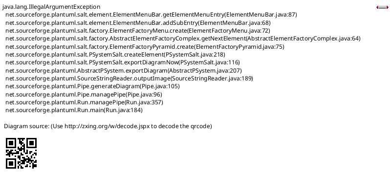

# User Guide Generation Protocol

## Overview

This protocol defines the systematic process for discovering applications in the CadLink codebase and generating comprehensive user guides. It covers:
- **GUI Applications**: WPF and Windows Forms with PlantUML+Salt UI diagrams
- **Command-Line Applications**: Console utilities with command syntax documentation
- **Windows Services**: Background services with configuration and management documentation

## Objectives

1. **Discovery**: Identify all applications (GUI, CLI, Services)
2. **Analysis**: Parse UI files, command-line arguments, service configurations
3. **Diagramming**: Create visual representations (PlantUML for GUI, command syntax for CLI)
4. **Documentation**: Generate comprehensive user guides with navigation, validation, and configuration details

## Phase 1: Application Discovery

### 1.1 Identify Applications by Type

#### A. GUI Applications

**Criteria for Inclusion**:
- WPF applications (App.xaml, MainWindow.xaml, or Window derivatives)
- Windows Forms applications (with Form classes)
- ASP.NET Web Forms (*.aspx pages)
- Has user-facing UI

**Discovery Method**:
```bash
# Find WPF applications (projects with App.xaml)
find . -name "App.xaml" -type f

# Find WPF window files
find . -name "*.xaml" -type f | grep -E "(Window|MainWindow|View)"

# Find .csproj files with WPF references
grep -r "WindowsBase" --include="*.csproj"
grep -r "PresentationCore" --include="*.csproj"
grep -r "PresentationFramework" --include="*.csproj"

# Find Windows Forms applications
grep -r "System.Windows.Forms" --include="*.csproj"

# Find ASP.NET Web Forms applications
find . -name "*.aspx" -type f
grep -r "System.Web" --include="*.csproj"
```

#### B. Command-Line Applications

**Criteria for Inclusion**:
- Console applications (OutputType=Exe)
- No GUI framework references
- Has Main() entry point with string[] args parameter

**Discovery Method**:
```bash
# Find console applications
grep -r "<OutputType>Exe</OutputType>" --include="*.csproj" | while read -r line; do
    proj_file=$(echo "$line" | cut -d: -f1)
    # Check if it's NOT a GUI app (no WPF/WinForms references)
    if ! grep -q "WindowsBase\|System.Windows.Forms\|PresentationCore" "$proj_file"; then
        echo "Console App: $proj_file"
    fi
done

# Find Program.cs files with Main() methods
find . -name "Program.cs" -type f -exec grep -l "static void Main\|static int Main" {} \;
```

#### C. Windows Services

**Criteria for Inclusion**:
- Inherits from ServiceBase
- Has OnStart/OnStop methods
- Typically installed via installutil or sc.exe

**Discovery Method**:
```bash
# Find Windows Services
grep -r "ServiceBase" --include="*.cs" -l

# Find service installers
grep -r "ServiceInstaller\|ServiceProcessInstaller" --include="*.cs" -l

# Find projects with System.ServiceProcess reference
grep -r "System.ServiceProcess" --include="*.csproj"
```

**Categorize Applications**:
- **Production Applications**: Main client/server control panels, services
- **Internal Tools**: Development and support utilities (GUI, CLI, web)
- **Utilities**: Single-purpose helper applications
- **Services**: Background services (CadLinkServer, CadLinkClient, etc.)

### 1.2 Application Metadata Collection

For each discovered application, collect:
- **Project Name**: From .csproj file
- **Application Type**: WPF, Windows Forms, ASP.NET, Console, or Windows Service
- **Primary Purpose**: From assembly info, comments, or CLAUDE.md
- **Entry Point**:
  - GUI: App.xaml.cs, Program.cs, or Main() method
  - CLI: Main(string[] args) method
  - Service: ServiceBase class, OnStart/OnStop methods
- **Main Windows/Interfaces**:
  - GUI: List of primary UI windows/forms
  - CLI: Command-line arguments and switches
  - Service: Service name, display name, description
- **Dependencies**: Referenced libraries and controls (especially DevExpress for GUI)

## Phase 2: UI Analysis

### 2.1 XAML Analysis (WPF Applications)

**For each .xaml file**:

1. **Parse Window Structure**:
   - Window title (`Title` attribute)
   - Window dimensions (`Width`, `Height`)
   - Main container (Grid, StackPanel, DockPanel, etc.)

2. **Identify UI Elements**:
   - **Input Controls**: TextBox, ComboBox, CheckBox, DatePicker, etc.
   - **Buttons**: Button, ToggleButton with Command bindings
   - **Data Grids**: DataGrid, ListView, TreeView
   - **Tabs**: TabControl with TabItems
   - **Menus**: Menu, ContextMenu
   - **Custom Controls**: DevExpress controls (DXGrid, DXButton, etc.)

3. **Extract Bindings**:
   - Data bindings (`{Binding PropertyName}`)
   - Command bindings (`{Binding CommandName}`)
   - Validation rules (ValidationRules, IDataErrorInfo)

4. **Identify Layout Structure**:
   - Grid rows/columns
   - Nested panels
   - GroupBox sections

### 2.2 Code-Behind Analysis

**For each .xaml.cs file**:

1. **Event Handlers**:
   - Button click handlers
   - Selection changed events
   - Validation logic

2. **Navigation Logic**:
   - Window opening (`new Window().Show()`)
   - Dialog boxes (`ShowDialog()`)
   - Tab switching

3. **Validation Rules**:
   - Input validation
   - Business rule validation
   - Error messages

4. **Configuration**:
   - Settings loading (`CadLinkSettings`, `ClientSettings`, etc.)
   - Configuration UI elements

5. **Data Operations**:
   - Database queries
   - Service calls
   - File operations

### 2.3 ViewModel Analysis (MVVM Pattern)

**If ViewModels are present**:

1. **Commands**: ICommand implementations
2. **Properties**: ObservableCollection, INotifyPropertyChanged
3. **Validation**: IDataErrorInfo, ValidationAttribute
4. **Business Logic**: Method documentation

### 2.4 Command-Line Application Analysis

**For Console Applications**:

1. **Command-Line Arguments**:
   - Parse Main(string[] args) method
   - Identify required vs optional arguments
   - Document argument order and format
   - Extract help text (--help, -h, /?)

2. **Command Modes**:
   - Identify different operation modes
   - Document mode selection logic
   - Extract mode-specific arguments

3. **Output Format**:
   - Console output patterns
   - Exit codes (success/failure)
   - Error messages
   - Progress indicators

4. **Configuration**:
   - Config file usage (App.config, JSON, etc.)
   - Environment variables
   - Default values

5. **Validation**:
   - Argument validation logic
   - Error messages for invalid input
   - Required dependencies checks

### 2.5 Windows Service Analysis

**For Windows Services**:

1. **Service Configuration**:
   - Service name, display name, description
   - ServiceType (Win32OwnProcess, etc.)
   - StartType (Automatic, Manual, Disabled)
   - Account (LocalSystem, NetworkService, custom)

2. **Service Lifecycle**:
   - OnStart() method - Initialization logic
   - OnStop() method - Cleanup logic
   - OnPause()/OnContinue() - Pause/resume support
   - OnShutdown() - System shutdown handling

3. **Service Operations**:
   - WCF service hosting
   - Timer-based background tasks
   - Event handling and triggers
   - Inter-process communication

4. **Configuration**:
   - App.config settings
   - Registry settings
   - Database-backed configuration
   - Configuration reload mechanisms

5. **Logging and Monitoring**:
   - Event log integration
   - Log file locations
   - Performance counters
   - Health check endpoints

6. **Installation**:
   - InstallUtil.exe usage
   - ServiceInstaller configuration
   - Custom installer actions
   - Uninstall procedures

## Phase 3: PlantUML+Salt Diagram Generation

**CRITICAL REQUIREMENTS**:
1. ✅ **ALL diagrams MUST use PlantUML format** (no screenshots, ASCII art, or other formats)
2. ✅ **ALL UI layouts MUST use PlantUML+Salt syntax** (not standard PlantUML class/sequence diagrams)
3. ⚠️ **Break complex UIs into multiple diagrams** to avoid `PLANTUML_LIMIT_SIZE: 4096` errors

**Why PlantUML+Salt?**:
- **Text-based**: Diagrams stored as code (version control friendly)
- **Consistent**: All user guides have uniform diagram style
- **Maintainable**: Easy to update when UI changes
- **Renderable**: Renders in Markdown viewers, GitHub, documentation sites

**Size Limit Warning**:
PlantUML has a 4096-pixel rendering limit. Complex UIs with 25+ controls will exceed this limit. See [Section 3.4](#34-handling-largecomplex-uis-avoiding-plantuml_limit_size-errors) for strategies to handle large UIs.

### 3.1 PlantUML+Salt Syntax Reference

**Basic Structure**:


**Layout Types**:
- `{` `}` - Basic group
- `{+` `}` - Header/Title group
- `{*` `}` - Tabbed group
- `{/` `}` - Tree structure
- `{#` `}` - Table structure

**Controls**:
- `[ ]` - Checkbox (unchecked)
- `[X]` - Checkbox (checked)
- `()` - Radio button (unchecked)
- `(X)` - Radio button (selected)
- `"text"` - Text input field
- `^dropdown^` - Dropdown/ComboBox
- `[Button]` or `[ Button ]` - Button
- `{T` `}` - Table/Grid

### 3.2 Mapping XAML to Salt

**Control Mapping**:

| XAML Control | Salt Representation |
|--------------|---------------------|
| TextBox | `"Input text here"` |
| Label | `Label text` |
| Button | `[Button Text]` |
| CheckBox | `[ ] Unchecked` or `[X] Checked` |
| RadioButton | `() Unchecked` or `(X) Checked` |
| ComboBox | `^Dropdown Options^` |
| DataGrid | `{#` table structure `}` |
| TabControl | `{*` tabbed structure `}` |
| TreeView | `{/` tree structure `}` |
| GroupBox | `{+` grouped content `}` |

**Grid Layout**:


**Tabs**:


**Tables/Grids**:


### 3.3 Diagram Generation Rules

**IMPORTANT**: All diagrams MUST use PlantUML format. All UI layouts MUST use PlantUML+Salt syntax.

**Basic Rules**:
1. **One diagram per major UI view/window** (or per logical section for complex UIs)
2. **Simplify complex layouts**: Focus on key functional areas
3. **Show default states**: Initial values, selected options
4. **Include validation indicators**: Required fields marked with *
5. **Group related controls**: Use grouping to show logical sections
6. **Show navigation**: Indicate which buttons open new windows/dialogs

### 3.4 Handling Large/Complex UIs: Avoiding PLANTUML_LIMIT_SIZE Errors

**Problem**: PlantUML has a size limit of 4096 pixels. Complex UIs with many controls can exceed this limit and cause rendering errors:
```
Error: PLANTUML_LIMIT_SIZE: 4096
```

**Solution**: Break complex UIs into multiple smaller diagrams, each representing a logical section or pane.

#### Strategy 1: Section-Based Breakdown

For applications with multiple logical sections, create one diagram per section:

**Example: CadLink Server Control Panel**

Instead of one massive diagram showing all tabs and controls:
```markdown
❌ BAD: Single diagram with 50+ controls across 5 tabs (exceeds size limit)

✅ GOOD: Separate diagrams for each logical area:
- Diagram 1: Overview tab (Connection Status, Service Status)
- Diagram 2: Database Configuration tab
- Diagram 3: Security Settings tab
- Diagram 4: Advanced Settings tab
- Diagram 5: Logs tab
```

**Implementation**:
```markdown
### Main Window Overview

The main window contains 5 tabs for different configuration areas.

#### Connection Status Section


#### Strategy 2: Tab-Based Breakdown

For tabbed interfaces, create one diagram per tab (NOT one diagram with all tabs):

**Example: Multi-Tab Application**

❌ **BAD** - All tabs in one diagram:


✅ **GOOD** - One diagram per tab:
```markdown
### Tab 1: General Settings


#### Strategy 3: Functional Area Breakdown

For single-page applications with many controls, group by functional area:

**Example: Complex Configuration Screen**

Break into logical functional areas:
```markdown
### Configuration Screen

The configuration screen has four functional areas:

#### Area 1: Connection Settings


#### Strategy 4: Grid Simplification

For large data grids, show representative rows (not all data):

❌ **BAD** - 50 rows in diagram (too large):


✅ **GOOD** - Show 2-3 representative rows:


#### Size Limit Guidelines

**Recommended Maximum per Diagram**:
- **Controls**: 15-20 input fields maximum
- **Grid rows**: 3-5 rows maximum (representative sample)
- **Tabs**: 1 tab per diagram (don't show all tab contents in one diagram)
- **Tree depth**: 3-4 levels maximum
- **Nested groups**: 3 levels maximum

**Signs You Need to Break Up a Diagram**:
- More than 25 controls in one diagram
- More than 10 rows in a grid
- More than 3 tabs with detailed content
- Deeply nested groups (4+ levels)
- Diagram height > 30 lines of Salt code

**Testing Your Diagrams**:
If you encounter `PLANTUML_LIMIT_SIZE: 4096` error:
1. Count controls in the diagram
2. Identify logical sections
3. Create separate diagrams for each section
4. Link sections with text descriptions
5. Test each diagram independently

### 3.5 PlantUML+Salt Best Practices

1. **Use descriptive section headers**: Label each diagram with its purpose
   ```markdown
   #### Connection Settings (Top Section)
   #### Database Settings (Middle Section)
   #### Action Buttons (Bottom Section)
   ```

2. **Reference other diagrams**: When breaking up a UI, reference related diagrams
   ```markdown
   The main window is divided into three sections (see diagrams below):
   - [Connection Settings](#connection-settings)
   - [Database Settings](#database-settings)
   - [Action Buttons](#action-buttons)
   ```

3. **Show spatial relationships**: Indicate where sections are located
   ```markdown
   #### Top Panel (Connection Status)
   Located at the top of the window...

   #### Middle Panel (Configuration)
   Located in the center...

   #### Bottom Panel (Action Buttons)
   Located at the bottom...
   ```

4. **Use consistent styling**: Apply the same Salt formatting across all diagrams
   - Bold headers: `<b>Header Text</b>`
   - Colors for emphasis: `<color:red>Error</color>`
   - Size for titles: `<size:18>Title</size>`

5. **Simplify, don't oversimplify**: Include enough detail for users to recognize the UI, but omit redundant decorative elements

### 3.6 Command-Line Interface Documentation (CLI Apps)

**For Console Applications**, replace PlantUML diagrams with command syntax documentation:

**Command Syntax Format**:
```
ApplicationName [OPTIONS] <REQUIRED_ARG> [OPTIONAL_ARG]

OPTIONS:
  --option1, -o1    Description of option 1
  --option2, -o2    Description of option 2
  --help, -h        Display help information

ARGUMENTS:
  REQUIRED_ARG      Description of required argument
  OPTIONAL_ARG      Description of optional argument (default: value)

EXIT CODES:
  0                 Success
  1                 Error/Failure
  2                 Invalid arguments

EXAMPLES:
  ApplicationName --option1 value1 arg1
  ApplicationName -o2 value2 arg1 arg2
```

**Usage Examples**:
- Provide 2-3 realistic usage examples
- Show expected output for each example
- Include error scenario examples

### 3.7 Windows Service Documentation (Services)

**For Windows Services**, document service management instead of diagrams:

**Service Information**:
```
Service Name:       CadLinkServer
Display Name:       Cadwell CadLink Server
Description:        Provides data synchronization and WCF services
Service Type:       Win32OwnProcess
Start Type:         Automatic
Account:            LocalSystem
Executable Path:    C:\Program Files\Cadwell\CadLink\CadLinkServer.exe
```

**Service Control Commands**:
```bash
# Start service
net start CadLinkServer
sc start CadLinkServer

# Stop service
net stop CadLinkServer
sc stop CadLinkServer

# Query status
sc query CadLinkServer

# Configure startup
sc config CadLinkServer start= auto|demand|disabled

# Install service
installutil CadLinkServer.exe

# Uninstall service
installutil /u CadLinkServer.exe
```

**Configuration Files**:
- Document App.config or web.config settings
- Show example configuration snippets
- Document registry settings if applicable

## Phase 4: User Guide Documentation

### 4.1 Document Structure Templates

**Note**: Select and adapt the appropriate template based on application type:
- **Template A**: GUI Applications (WPF, Windows Forms, ASP.NET)
- **Template B**: Command-Line Applications (Console)
- **Template C**: Windows Services

---

#### Template A: GUI Applications

```markdown
# {Application Name} User Guide

## Table of Contents

- [Overview](#overview)
- [Prerequisites](#prerequisites)
- [Launching the Application](#launching-the-application)
- [User Interface Overview](#user-interface-overview)
  - [Main Window](#main-window)
  - [UI Sections](#ui-sections)
- [Common Tasks](#common-tasks)
- [Navigation](#navigation)
- [Configuration](#configuration)
- [Validation Rules](#validation-rules)
- [Troubleshooting](#troubleshooting)
- [Technical Details](#technical-details)
- [Related Documentation](#related-documentation)

## Overview

Brief description of the application's purpose and when to use it.

**Application Type**: [WPF/Windows Forms/ASP.NET Web Forms]
**Primary Users**: [Administrators/Clinicians/Support Staff]
**Location**: `{Project Path}`

## Prerequisites

- Required permissions
- Dependencies (e.g., "CadLink Server must be running")
- Configuration requirements

## Launching the Application

How to start the application:
- From Start Menu
- From installer location
- Command-line arguments (if applicable)

## User Interface Overview

### Main Window


**Description**: High-level description of main window layout and sections.

### UI Sections

#### Section 1: {Section Name}

**Purpose**: What this section does

**Controls**:
- **Field Name**: Description, validation rules, default value
- **Button Name**: What happens when clicked

**Workflow**:
1. Step 1
2. Step 2
3. Step 3

## Common Tasks

### Task 1: {Task Name}

**Purpose**: Why you would do this

**Steps**:
1. Navigate to {location}
2. Enter {data}
3. Click {button}
4. Verify {result}

**Validation**:
- Field X must be...
- Error messages and how to resolve

**Example**:
```
Example scenario or screenshot description
```

### Task 2: {Task Name}

[Repeat structure]

## Navigation

### Window Hierarchy

```
Main Window
├── Dialog 1
│   └── Sub-dialog
├── Dialog 2
└── Settings Window
```

### Menu Structure (if applicable)

- **File**
  - New
  - Open
  - Save
  - Exit
- **Edit**
  - ...

## Configuration

### Settings Managed by This Application

| Setting Name | Location | Default Value | Description |
|--------------|----------|---------------|-------------|
| Setting1 | Registry/Config | Default | Purpose |

### How to Configure

1. Step-by-step instructions
2. ...

## Validation Rules

### Input Validation

| Field | Rules | Error Message |
|-------|-------|---------------|
| Field1 | Required, max 50 chars | "Field1 is required" |
| Field2 | Numeric, > 0 | "Must be positive number" |

### Business Rules

- Rule 1: Description
- Rule 2: Description

## Troubleshooting

### Common Issues

#### Issue 1: {Error or Problem}

**Symptoms**: What the user sees

**Cause**: Why this happens

**Resolution**:
1. Step 1
2. Step 2

#### Issue 2: {Error or Problem}

[Repeat structure]

## Technical Details

### Dependencies

- Required DLLs
- Database access requirements
- Service dependencies

### Entry Point

- **File**: `{Namespace.ClassName}`
- **Method**: `Main()` or `OnStartup()`

### Code-Behind Files

- `{Window1.xaml.cs}`: Description
- `{Window2.xaml.cs}`: Description

## Related Documentation

- Link to design docs
- Link to API documentation
- Link to troubleshooting guides

---

**Last Updated**: {Date}
**Application Version**: {Version from AssemblyInfo}
**Documented By**: {Author/Process}
```

---

#### Template B: Command-Line Applications

```markdown
# {Application Name} User Guide

## Table of Contents

- [Overview](#overview)
- [Prerequisites](#prerequisites)
- [Installation](#installation)
- [Command-Line Interface](#command-line-interface)
  - [Syntax](#syntax)
  - [Arguments and Options](#arguments-and-options)
  - [Exit Codes](#exit-codes)
- [Common Tasks](#common-tasks)
- [Command Reference](#command-reference)
- [Configuration](#configuration)
- [Validation Rules](#validation-rules)
- [Error Messages](#error-messages)
- [Troubleshooting](#troubleshooting)
- [Technical Details](#technical-details)
- [Related Documentation](#related-documentation)

## Overview

Brief description of the application's purpose and when to use it.

**Application Type**: Console/Command-Line
**Primary Users**: [Administrators/Developers/Support Staff]
**Location**: `{Project Path}`

## Prerequisites

- Operating system requirements
- Required permissions
- Dependencies (frameworks, libraries)
- Configuration requirements

## Installation

How to install or deploy the application:
- Copy to specific directory
- Add to PATH environment variable
- Create shortcuts or batch files

## Command-Line Interface

### Syntax

```
ApplicationName [OPTIONS] <REQUIRED_ARG> [OPTIONAL_ARG]
```

### Arguments and Options

| Argument/Option | Type | Required | Default | Description |
|-----------------|------|----------|---------|-------------|
| --option1, -o1 | string | No | default | Description of option 1 |
| ARG1 | string | Yes | - | Description of argument 1 |

### Exit Codes

| Code | Meaning |
|------|---------|
| 0 | Success |
| 1 | General error |
| 2 | Invalid arguments |
| 3 | Specific error condition |

## Common Tasks

### Task 1: {Task Name}

**Purpose**: Why you would do this

**Command**:
```bash
ApplicationName --option1 value1 arg1
```

**Expected Output**:
```
Output text here...
```

**Validation**:
- Argument X must be...
- Error messages and how to resolve

## Command Reference

### Command Mode 1: {Mode Name}

**Usage**:
```
ApplicationName mode1 [OPTIONS] <ARGS>
```

**Description**: What this command mode does

**Options**:
- `--opt1`: Description
- `--opt2`: Description

**Examples**:
```bash
ApplicationName mode1 --opt1 value arg1
```

## Configuration

### Configuration Files

- **App.config**: Application configuration
- **{config.json}**: Custom configuration file

### Environment Variables

| Variable | Default | Description |
|----------|---------|-------------|
| VAR_NAME | default | Purpose |

### How to Configure

1. Edit configuration file
2. Set environment variables
3. Use command-line options

## Validation Rules

### Argument Validation

| Argument | Rules | Error Message |
|----------|-------|---------------|
| ARG1 | Required, format: X | "Invalid format for ARG1" |

### Business Rules

- Rule 1: Description
- Rule 2: Description

## Error Messages

| Error Message | Cause | Resolution |
|---------------|-------|------------|
| "Error text" | Why this happens | How to fix |

## Troubleshooting

### Common Issues

#### Issue 1: Command not found

**Symptoms**: "ApplicationName is not recognized..."

**Cause**: Application not in PATH

**Resolution**:
1. Add application directory to PATH
2. Use full path to executable

## Technical Details

### Dependencies

- .NET Framework version
- Required libraries
- External tools

### Entry Point

- **File**: `Program.cs`
- **Method**: `static int Main(string[] args)`

### Logging

- Log file location
- Log levels
- How to enable verbose logging

## Related Documentation

- Link to design docs
- Link to API documentation
- Link to troubleshooting guides

---

**Last Updated**: {Date}
**Application Version**: {Version from AssemblyInfo}
**Documented By**: {Author/Process}
```

---

#### Template C: Windows Services

```markdown
# {Service Name} Service Guide

## Table of Contents

- [Overview](#overview)
- [Prerequisites](#prerequisites)
- [Installation](#installation)
  - [Install Service](#install-service)
  - [Configure Service](#configure-service)
  - [Uninstall Service](#uninstall-service)
- [Service Management](#service-management)
  - [Starting and Stopping](#starting-and-stopping)
  - [Service Status](#service-status)
  - [Restart Procedures](#restart-procedures)
- [Configuration](#configuration)
- [Monitoring and Logging](#monitoring-and-logging)
- [Troubleshooting](#troubleshooting)
- [Technical Details](#technical-details)
- [Related Documentation](#related-documentation)

## Overview

Brief description of the service's purpose and functionality.

**Service Name**: {ServiceName}
**Display Name**: {Display Name}
**Service Type**: Windows Service
**Primary Users**: System Administrators
**Location**: `{Project Path}`

## Prerequisites

- Operating system requirements (Windows Server versions)
- Required permissions (Administrator)
- Dependencies (databases, network services)
- Ports and firewall requirements

## Installation

### Install Service

**Using InstallUtil** (recommended):
```bash
cd "C:\Program Files\{Company}\{Product}"
"%SystemRoot%\Microsoft.NET\Framework64\v4.0.30319\InstallUtil.exe" ServiceName.exe
```

**Using SC.exe**:
```bash
sc create ServiceName binPath= "C:\Path\To\ServiceName.exe" start= auto
sc description ServiceName "Service description here"
```

### Configure Service

**Service Properties**:
- **Startup Type**: Automatic / Manual / Disabled
- **Log On As**: LocalSystem / NetworkService / Custom Account
- **Recovery Options**: Restart service on failure

**Steps**:
1. Open Services (services.msc)
2. Locate {ServiceName}
3. Right-click → Properties
4. Configure Startup type, Log on account, Recovery

### Uninstall Service

**Using InstallUtil**:
```bash
"%SystemRoot%\Microsoft.NET\Framework64\v4.0.30319\InstallUtil.exe" /u ServiceName.exe
```

**Using SC.exe**:
```bash
sc stop ServiceName
sc delete ServiceName
```

## Service Management

### Starting and Stopping

**Using Services MMC**:
1. Open Services (services.msc)
2. Locate {ServiceName}
3. Right-click → Start / Stop / Restart

**Using Command Line**:
```bash
# Start service
net start ServiceName
sc start ServiceName

# Stop service
net stop ServiceName
sc stop ServiceName

# Restart service (stop then start)
net stop ServiceName && net start ServiceName
```

**Using PowerShell**:
```powershell
Start-Service -Name "ServiceName"
Stop-Service -Name "ServiceName"
Restart-Service -Name "ServiceName"
```

### Service Status

**Check Status**:
```bash
sc query ServiceName
```

**Output**:
```
SERVICE_NAME: ServiceName
TYPE               : 10  WIN32_OWN_PROCESS
STATE              : 4  RUNNING
...
```

**Possible States**:
- `STOPPED`: Service is not running
- `START_PENDING`: Service is starting
- `RUNNING`: Service is operational
- `STOP_PENDING`: Service is stopping
- `PAUSED`: Service is paused

### Restart Procedures

**Graceful Restart**:
1. Stop dependent services (if any)
2. Stop main service
3. Wait 5-10 seconds
4. Start main service
5. Start dependent services

**Force Restart** (if service hangs):
```bash
taskkill /F /IM ServiceName.exe
net start ServiceName
```

## Configuration

### Configuration Files

**App.config / ServiceName.exe.config**:
```xml
<configuration>
  <appSettings>
    <add key="Setting1" value="Value1" />
    <add key="Setting2" value="Value2" />
  </appSettings>
  <connectionStrings>
    <add name="Database" connectionString="..." />
  </connectionStrings>
</configuration>
```

### Configuration Settings

| Setting | Location | Default | Description |
|---------|----------|---------|-------------|
| Setting1 | App.config | default | Purpose |
| Setting2 | Registry | default | Purpose |

### Registry Settings

**Location**: `HKEY_LOCAL_MACHINE\SOFTWARE\{Company}\{Product}`

| Key | Type | Default | Description |
|-----|------|---------|-------------|
| RegistryKey1 | REG_SZ | default | Purpose |

### How to Apply Configuration Changes

1. Stop the service
2. Edit configuration file or registry
3. Start the service
4. Verify changes in event log

## Monitoring and Logging

### Event Log

**Event Log Name**: Application
**Event Source**: {ServiceName}

**View Events**:
```bash
# Using Event Viewer
eventvwr.msc

# Using PowerShell
Get-EventLog -LogName Application -Source "{ServiceName}" -Newest 50
```

### Log Files

**Location**: `C:\ProgramData\{Company}\{Product}\Logs\`

**Log Files**:
- `ServiceName.log`: Main service log
- `ServiceName-error.log`: Error log

### Performance Counters

If applicable, document performance counters:
- Counter name
- Category
- Instance
- Description

### Health Checks

- Service status check
- Database connectivity
- Network endpoint availability
- Resource usage (CPU, Memory)

## Troubleshooting

### Common Issues

#### Issue 1: Service Fails to Start

**Symptoms**: Service shows "Starting" then returns to "Stopped"

**Cause**: Configuration error, missing dependencies, port conflict

**Resolution**:
1. Check Event Log for error messages
2. Verify configuration file is valid XML
3. Check database connectivity
4. Verify required ports are available
5. Check service account permissions

#### Issue 2: Service Stops Unexpectedly

**Symptoms**: Service was running, now shows "Stopped"

**Cause**: Unhandled exception, resource exhaustion, external dependency failure

**Resolution**:
1. Check Event Log for exception details
2. Review log files for errors
3. Check database connectivity
4. Verify disk space availability
5. Check memory usage

## Technical Details

### Dependencies

**Framework**:
- .NET Framework version

**Referenced Services**:
- SQL Server (if applicable)
- IIS (if hosting WCF)

**Required Ports**:
- Port 8080: WCF service endpoint
- Port 1433: SQL Server connection

### Service Architecture

**Service Lifecycle**:
1. `OnStart()`: Initialization
   - Load configuration
   - Initialize database connections
   - Start WCF services
   - Start background timers

2. `OnStop()`: Cleanup
   - Stop WCF services
   - Close database connections
   - Flush logs
   - Release resources

3. `OnPause()` / `OnContinue()`: Pause/Resume support
   - Pause background operations
   - Keep connections open

### WCF Services Hosted

If service hosts WCF services:
- Service contract names
- Endpoint addresses
- Binding configurations

### Background Operations

- Timer intervals
- Scheduled tasks
- Event-driven operations

## Related Documentation

- Link to design docs
- Link to API documentation
- Link to configuration guide
- Link to troubleshooting docs

---

**Last Updated**: {Date}
**Service Version**: {Version from AssemblyInfo}
**Documented By**: {Author/Process}
```

---

### 4.2 Content Guidelines

**Tone**:
- Clear, concise, user-friendly
- Assume user has basic Windows knowledge but not deep technical expertise
- Use screenshots/diagrams where helpful

**Completeness**:
- Document all major workflows
- Include edge cases and error scenarios
- Provide examples for complex operations

**Accuracy**:
- Test all documented procedures
- Verify keyboard shortcuts
- Confirm validation rules match implementation

**Maintenance**:
- Date the documentation
- Version the application it documents
- Update when UI changes

## Phase 5: Automation Workflow

### 5.1 Discovery Script

```bash
#!/bin/bash
# discover-graphic-apps.sh

echo "# CadLink Graphic Applications" > apps-discovered.md
echo "" >> apps-discovered.md

# Find WPF applications
echo "## WPF Applications" >> apps-discovered.md
echo "" >> apps-discovered.md

find Source -name "App.xaml" | while read -r file; do
    project_dir=$(dirname "$file")
    project_name=$(basename "$project_dir")

    echo "### $project_name" >> apps-discovered.md
    echo "- **Path**: $project_dir" >> apps-discovered.md
    echo "- **Type**: WPF" >> apps-discovered.md

    # Count XAML files
    xaml_count=$(find "$project_dir" -name "*.xaml" | wc -l)
    echo "- **XAML Files**: $xaml_count" >> apps-discovered.md
    echo "" >> apps-discovered.md
done
```

### 5.2 XAML Parser (Conceptual)

For each XAML file:
1. Parse XML structure
2. Extract Window title, dimensions
3. Identify all controls with x:Name
4. Map to Salt syntax
5. Generate diagram

### 5.3 Code Analysis (Conceptual)

For each .xaml.cs file:
1. Extract event handlers
2. Find navigation calls (new Window(), ShowDialog())
3. Extract validation logic
4. Document configuration access

### 5.4 Document Generation Pipeline

```
Input: Application Project Directory
  ↓
Step 1: Parse all XAML files → Extract UI structure
  ↓
Step 2: Analyze code-behind → Extract behavior
  ↓
Step 3: Generate PlantUML diagrams → One per window
  ↓
Step 4: Generate markdown document → Follow template
  ↓
Output: docs/apps/{application-name}.md
```

## Phase 6: Quality Assurance

### 6.1 Checklist per Application

- [ ] Application discovered and categorized
- [ ] All major windows documented
- [ ] PlantUML diagrams generated for each window
- [ ] **All diagrams use PlantUML+Salt format (NO screenshots, ASCII art, or other formats)**
- [ ] **All diagrams render without PLANTUML_LIMIT_SIZE errors** (test each diagram)
- [ ] **Complex UIs broken into multiple diagrams** (max 15-20 controls per diagram)
- [ ] Navigation paths documented
- [ ] Validation rules documented
- [ ] Configuration settings documented
- [ ] Common tasks include step-by-step instructions
- [ ] Troubleshooting section includes known issues
- [ ] Document follows template structure
- [ ] Technical details are accurate
- [ ] Examples included where helpful

### 6.1.1 Diagram Quality Checklist

For each PlantUML diagram in the guide:
- [ ] Diagram uses `@startsalt` / `@endsalt` syntax
- [ ] Diagram has fewer than 25 controls
- [ ] Grid tables show 3-5 representative rows (not all data)
- [ ] Tabbed interfaces use one diagram per tab (not all tabs in one diagram)
- [ ] Diagram renders without errors when tested with PlantUML renderer
- [ ] Diagram is referenced from text with descriptive context
- [ ] Related diagrams are cross-referenced with anchor links

### 6.2 Review Process

1. **Technical Review**: Developer verifies accuracy
2. **User Testing**: End user follows guide to complete tasks
3. **Feedback Integration**: Update documentation based on testing
4. **Version Control**: Commit to repository with version tag

## Phase 7: Maintenance Protocol

### 7.1 Triggers for Update

- UI changes (new windows, controls, layouts)
- Workflow changes
- New features added
- Validation rules modified
- Bug fixes that affect user experience

### 7.2 Update Process

1. Identify changed XAML/code files
2. Regenerate affected PlantUML diagrams
3. Update markdown documentation sections
4. Update "Last Updated" date
5. Commit with descriptive message

### 7.3 Versioning

- Document version should match application version
- Include "Last Updated" date in each guide
- Link to specific commit/tag in git

## Phase 8: Review and Update Existing User Guides

### 8.1 When to Run Review Process

**Trigger Scenarios**:
1. **After Getting Latest**: Code changes pulled from version control
2. **Before Release**: Pre-deployment validation of documentation accuracy
3. **Scheduled Review**: Monthly or quarterly documentation audit
4. **Major Refactoring**: Significant codebase changes
5. **User Feedback**: Reports of outdated or inaccurate documentation

**Command Invocation**:
```
"review and update user guides"
```

This command initiates a systematic review of all existing user guides against the current codebase.

### 8.2 Review Process Overview

```
Step 1: Detect Changed Applications
  ↓
Step 2: Compare Documentation vs Code
  ↓
Step 3: Identify Discrepancies
  ↓
Step 4: Update Affected Sections
  ↓
Step 5: Validate Updates
  ↓
Step 6: Update Metadata (Last Updated date, version)
```

### 8.3 Step 1: Detect Changed Applications

**Objective**: Identify which applications have code changes since last documentation update

#### Method A: Git-Based Detection (Recommended)

**Find modified files since last doc update**:
```bash
# For each documented application, check for changes
# Read "Last Updated" date from user guide
LAST_UPDATE="2025-10-17"

# Find all .xaml, .xaml.cs, .cs, .csproj files modified after last update
git log --since="$LAST_UPDATE" --name-only --pretty=format: | \
  grep -E "\.(xaml|cs|csproj)$" | \
  sort -u

# Group by application/project directory
git log --since="$LAST_UPDATE" --name-only --pretty=format: | \
  grep -E "Source/" | \
  cut -d/ -f1-4 | \
  sort -u
```

**Output Example**:
```
Modified Applications:
- Source/CadLinkServerControlPanel/ (15 file changes)
- Source/Tools/HL7TestSender/ (3 file changes)
- InternalTools/EncryptionManager/ (7 file changes)
```

#### Method B: File Timestamp Comparison

Compare file modification times against documentation "Last Updated" date:
```bash
# Find user guide last updated date
GUIDE_FILE="docs/apps/cadlink-server-control-panel.md"
GUIDE_DATE=$(grep "Last Updated" "$GUIDE_FILE" | cut -d: -f2 | xargs)

# Find application files modified after guide date
APP_DIR="Source/CadLinkServerControlPanel/"
find "$APP_DIR" -name "*.xaml" -o -name "*.cs" -newermt "$GUIDE_DATE"
```

#### Method C: Manual Selection

Specify applications to review explicitly:
```
Review applications: CadLinkServerControlPanel, HL7TestSender, Scheduler
```

### 8.4 Step 2: Compare Documentation vs Code

**For each identified application**, perform systematic comparison:

#### 2A. Compare UI Structure (GUI Applications)

**Check XAML files**:
1. **Window Title**: Compare XAML `Title` attribute vs documented title
2. **Window Dimensions**: Compare `Width`/`Height` vs documented size
3. **Controls Count**: Count controls in XAML vs PlantUML diagram
4. **Tab Structure**: Compare TabItems in XAML vs documented tabs
5. **Grid Layout**: Compare Grid rows/columns vs diagram layout

**Detection Script** (conceptual):
```bash
# Extract window title from XAML
XAML_TITLE=$(grep -oP 'Title="[^"]+"' MainWindow.xaml | cut -d'"' -f2)

# Extract documented title from user guide
DOC_TITLE=$(grep "^# " docs/apps/app-name.md | sed 's/# //' | sed 's/ User Guide//')

# Compare
if [ "$XAML_TITLE" != "$DOC_TITLE" ]; then
    echo "MISMATCH: Window title changed"
    echo "  Code:    $XAML_TITLE"
    echo "  Docs:    $DOC_TITLE"
fi
```

#### 2B. Compare Code-Behind Logic

**Check .xaml.cs files**:
1. **Event Handlers**: Compare method names vs documented button actions
2. **Validation Rules**: Compare validation logic vs documented validation rules
3. **Error Messages**: Compare message strings vs documented error messages
4. **Navigation**: Compare window opening calls vs documented navigation

**Example Checks**:
```csharp
// Find all button click handlers
grep -r "void.*Click\|void.*Button" --include="*.xaml.cs"

// Find all validation messages
grep -r "MessageBox.Show\|ValidationError" --include="*.xaml.cs"

// Find all window creation
grep -r "new.*Window\|ShowDialog" --include="*.xaml.cs"
```

#### 2C. Compare Command-Line Interface (CLI Applications)

**Check Program.cs**:
1. **Argument Count**: Compare `args.Length` checks vs documented arguments
2. **Help Text**: Compare console output vs documented syntax
3. **Exit Codes**: Compare `return` values vs documented exit codes
4. **Modes**: Compare switch/if logic vs documented command modes

#### 2D. Compare Service Configuration (Windows Services)

**Check service files and config**:
1. **Service Name**: Compare ServiceInstaller.ServiceName vs documented name
2. **Service Description**: Compare ServiceInstaller.Description vs documented description
3. **Configuration Settings**: Compare App.config keys vs documented settings
4. **Port Numbers**: Compare endpoint addresses vs documented ports

### 8.5 Step 3: Identify Discrepancies

**Categorize Changes**:

#### Category 1: Critical Changes (Require Doc Update)

- [ ] **UI Layout Changes**: New controls, removed controls, repositioned elements
- [ ] **Feature Additions**: New buttons, new tabs, new functionality
- [ ] **Feature Removals**: Removed buttons, removed tabs, deprecated features
- [ ] **Workflow Changes**: Different step order, new prerequisites, changed behavior
- [ ] **Validation Changes**: New validation rules, changed error messages
- [ ] **Configuration Changes**: New settings, changed defaults, removed settings

#### Category 2: Moderate Changes (Should Update)

- [ ] **Label Changes**: Button text changed, field labels changed
- [ ] **Default Value Changes**: Different initial values
- [ ] **Window Title Changes**: Renamed windows
- [ ] **Help Text Changes**: Updated tooltips or hints

#### Category 3: Minor Changes (Optional Update)

- [ ] **Code Refactoring**: Internal changes, no user-visible impact
- [ ] **Comment Changes**: Code documentation updates
- [ ] **Whitespace Changes**: Formatting only

**Output Format**:
```markdown
## Review Report: CadLinkServerControlPanel

**Guide File**: docs/apps/cadlink-server-control-panel.md
**Last Updated**: 2025-10-10
**Code Last Modified**: 2025-10-17 (7 days outdated)

### Critical Changes Detected:
1. ❌ **New Tab Added**: "Backup Settings" tab not documented
   - File: MainWindow.xaml:234
   - Action: Add new section to guide with PlantUML diagram

2. ❌ **Button Removed**: "Reset to Defaults" button no longer exists
   - File: MainWindow.xaml (removed at line 156)
   - Action: Remove from Common Tasks section

3. ❌ **Validation Changed**: Port number now requires range 1024-65535
   - File: MainWindow.xaml.cs:312
   - Action: Update Validation Rules section

### Moderate Changes Detected:
1. ⚠️ **Label Changed**: "Database Path" → "Database Location"
   - File: MainWindow.xaml:89
   - Action: Update UI diagram and field descriptions

### Minor Changes Detected:
1. ℹ️ **Code refactored**: Event handler renamed (no user impact)
   - File: MainWindow.xaml.cs:156-170
   - Action: No documentation change needed
```

### 8.6 Step 4: Update Affected Sections

**For each detected discrepancy**, update the corresponding guide section:

#### Update Workflow:

**1. UI Changes → Update PlantUML Diagrams**
```markdown
❌ OLD:


**2. New Feature → Add Common Task**
```markdown
### Task 7: Configure Automatic Backups (NEW)

**Purpose**: Schedule automatic database backups

**Steps**:
1. Navigate to **Backup Settings** tab
2. Enable **Automatic Backup** checkbox
3. Set **Backup Frequency** (Daily/Weekly/Monthly)
4. Choose **Backup Location**
5. Click **Save Settings**

**Validation**:
- Backup location must be writable
- Minimum disk space: 10 GB

**File Reference**: MainWindow.xaml.cs:456-489 (ConfigureBackup method)
```

**3. Removed Feature → Delete or Mark as Deprecated**
```markdown
❌ REMOVE THIS SECTION (feature no longer exists):
### Task 5: Reset Configuration to Defaults
...

OR (if recently removed, mark as deprecated):
### Task 5: Reset Configuration to Defaults ⚠️ DEPRECATED as of v6.2.0
**Note**: This feature was removed in version 6.2.0. Use manual configuration instead.
```

**4. Validation Changes → Update Validation Rules Table**
```markdown
❌ OLD:
| Port | Numeric, > 0 | "Port must be positive number" |

✅ NEW:
| Port | Numeric, 1024-65535 | "Port must be between 1024 and 65535" |
```

**5. Configuration Changes → Update Configuration Section**
```markdown
NEW SETTING ADDED:
| AutoBackupEnabled | App.config | false | Enable automatic database backups |
| BackupFrequency | App.config | Daily | Backup frequency (Daily/Weekly/Monthly) |
```

### 8.7 Step 5: Validate Updates

**After updating each guide**, perform validation:

#### Validation Checklist:

- [ ] **PlantUML Diagrams Render**: Test each updated diagram with PlantUML renderer
- [ ] **No PLANTUML_LIMIT_SIZE Errors**: Verify diagram size within limits
- [ ] **Code References Accurate**: Verify line numbers and file paths exist
- [ ] **Cross-References Work**: Test anchor links between sections
- [ ] **Table of Contents Updated**: Add/remove TOC entries for new/deleted sections
- [ ] **Consistent Formatting**: Follow template structure
- [ ] **Examples Still Valid**: Verify example scenarios work with new code
- [ ] **Troubleshooting Relevant**: Remove obsolete issues, add new ones

#### Automated Validation Script (conceptual):

```bash
#!/bin/bash
# validate-user-guide.sh

GUIDE_FILE="$1"

echo "Validating: $GUIDE_FILE"

# Check 1: PlantUML syntax
grep -Pzo '@startsalt.*?@endsalt' "$GUIDE_FILE" | \
  while IFS= read -r -d '' diagram; do
    echo "$diagram" | plantuml -syntax
  done

# Check 2: File references exist
grep -oP '`[^`]+\.(cs|xaml|config)`' "$GUIDE_FILE" | \
  while read -r file; do
    file=$(echo "$file" | tr -d '`')
    if [ ! -f "$file" ]; then
      echo "WARNING: Referenced file not found: $file"
    fi
  done

# Check 3: Anchor links valid
grep -oP '\[.*?\]\(#[^)]+\)' "$GUIDE_FILE" | \
  grep -oP '#[^)]+' | \
  while read -r anchor; do
    # Check if anchor exists in file
    if ! grep -q "## .*$(echo $anchor | tr '-' ' ')" "$GUIDE_FILE"; then
      echo "WARNING: Broken anchor link: $anchor"
    fi
  done

# Check 4: Last Updated date is today
if ! grep -q "Last Updated.*$(date +%Y-%m-%d)" "$GUIDE_FILE"; then
  echo "WARNING: Last Updated date not current"
fi

echo "Validation complete"
```

### 8.8 Step 6: Update Metadata

**For each updated guide**, update the footer metadata:

```markdown
---

**Last Updated**: 2025-10-17  ← UPDATE THIS
**Application Version**: 6.2.0  ← UPDATE IF VERSION CHANGED
**Documented By**: Claude Code (Review Update)  ← INDICATE REVIEW

---
```

**Add changelog entry** (if guide has changelog section):
```markdown
## Changelog

- **2025-10-17**: Updated for version 6.2.0 - Added Backup Settings tab, removed Reset to Defaults button, updated Port validation rules
- **2025-10-10**: Updated for version 6.1.0 - Added Database encryption settings
- **2025-09-15**: Initial documentation for version 6.0.0
```

### 8.9 Review Report Generation

**After completing review**, generate summary report:

```markdown
# User Guide Review Report
**Date**: 2025-10-17
**Scope**: All applications with code changes since last update
**Reviewer**: Claude Code

## Summary Statistics
- **Applications Reviewed**: 8
- **Guides Requiring Updates**: 5
- **Guides Up-to-Date**: 3
- **Critical Changes**: 12
- **Moderate Changes**: 8
- **Minor Changes**: 23
- **Total Sections Updated**: 45
- **Diagrams Regenerated**: 7

## Updated Guides

### 1. CadLinkServerControlPanel ✅ UPDATED
- **Changes**: 3 critical, 2 moderate
- **Updates Made**:
  - Added "Backup Settings" tab documentation (new section)
  - Removed "Reset to Defaults" task (deprecated)
  - Updated Port validation rules (1024-65535)
  - Updated field label: "Database Path" → "Database Location"
- **Files Modified**: docs/apps/cadlink-server-control-panel.md
- **Diagrams Updated**: 2 (Main Window, Database Configuration)

### 2. HL7TestSender ✅ UPDATED
- **Changes**: 1 critical, 1 moderate
- **Updates Made**:
  - Added SSL certificate validation section
  - Updated default port: 12321 → 12322
- **Files Modified**: docs/apps/hl7-test-sender.md
- **Diagrams Updated**: 0

### 3. Scheduler ℹ️ UP-TO-DATE
- **Changes**: 0 critical, 0 moderate, 3 minor
- **Action**: No updates needed (minor code refactoring only)

## Action Items
- [ ] Review updated guides with subject matter expert
- [ ] Test documented procedures in dev environment
- [ ] Commit updated guides to version control
- [ ] Notify documentation consumers of changes

## Next Review
**Recommended Date**: 2025-11-17 (30 days from now)
```

### 8.10 Bulk Review Automation

**For large-scale reviews** (e.g., quarterly audit of all 58 applications):

#### Automated Review Script Template:

```bash
#!/bin/bash
# review-all-user-guides.sh

DOCS_DIR="docs/apps"
APPS_DIR="Source"
REPORT_FILE="review-report-$(date +%Y-%m-%d).md"

echo "# User Guide Review Report" > "$REPORT_FILE"
echo "**Date**: $(date +%Y-%m-%d)" >> "$REPORT_FILE"
echo "" >> "$REPORT_FILE"

# Find all user guides
find "$DOCS_DIR" -name "*.md" -type f | while read -r guide; do
    # Extract application name from guide filename
    app_name=$(basename "$guide" .md)

    # Find corresponding application directory
    app_dir=$(find "$APPS_DIR" -type d -iname "*$app_name*" | head -n 1)

    if [ -n "$app_dir" ]; then
        echo "## Reviewing: $app_name"

        # Compare modification dates
        guide_date=$(stat -c %Y "$guide")
        app_date=$(find "$app_dir" -name "*.xaml" -o -name "*.cs" | \
                   xargs stat -c %Y | sort -nr | head -n 1)

        if [ "$app_date" -gt "$guide_date" ]; then
            echo "⚠️ $app_name: Code newer than docs (requires review)" >> "$REPORT_FILE"
            # Generate detailed diff report
            # ... (call detailed comparison functions)
        else
            echo "✅ $app_name: Up-to-date" >> "$REPORT_FILE"
        fi
    else
        echo "❓ $app_name: Application directory not found" >> "$REPORT_FILE"
    fi
done

echo "Review complete. Report saved to: $REPORT_FILE"
```

### 8.11 Integration with Continuous Integration (CI)

**Add documentation validation to CI pipeline**:

#### Example: GitHub Actions Workflow

```yaml
name: Documentation Review
on:
  push:
    paths:
      - 'Source/**/*.xaml'
      - 'Source/**/*.cs'
      - 'InternalTools/**/*.xaml'
      - 'InternalTools/**/*.cs'

jobs:
  check-docs:
    runs-on: ubuntu-latest
    steps:
      - uses: actions/checkout@v2

      - name: Check for outdated documentation
        run: |
          # Compare file modification times
          ./scripts/check-doc-freshness.sh

      - name: Create issue if docs outdated
        if: failure()
        uses: actions/github-script@v6
        with:
          script: |
            github.rest.issues.create({
              owner: context.repo.owner,
              repo: context.repo.repo,
              title: 'User guides may be outdated',
              body: 'Code changes detected. Please review and update user guides.',
              labels: ['documentation']
            })
```

### 8.12 Best Practices for Review Process

1. **Review Frequency**:
   - **After every merge**: Quick check for affected applications
   - **Weekly**: Review most-changed applications
   - **Monthly**: Full audit of all applications
   - **Before releases**: Mandatory validation

2. **Prioritize Reviews**:
   - **High Priority**: Production applications, frequently-used tools
   - **Medium Priority**: Internal tools, occasional-use applications
   - **Low Priority**: Deprecated applications, rarely-used utilities

3. **Incremental Updates**:
   - Update guides as code changes, not in big batches
   - Small, frequent updates are easier than large rewrites

4. **Version Correlation**:
   - Tag documentation versions to match application versions
   - Use semantic versioning (major.minor.patch)

5. **Stakeholder Communication**:
   - Notify users when documentation is updated
   - Highlight significant changes in release notes
   - Maintain changelog in each guide

6. **Quality Over Speed**:
   - Take time to test documented procedures
   - Verify all diagrams render correctly
   - Ensure examples are accurate and current

## Implementation Notes

### Tool Recommendations

- **XAML Parsing**: System.Xaml libraries, XDocument (C#/.NET)
- **Code Analysis**: Roslyn analyzers for C# parsing
- **Diagram Generation**: PlantUML command-line tool
- **Documentation Generation**: Template engine (Handlebars, Razor)

### Challenges and Solutions

| Challenge | Solution |
|-----------|----------|
| **PLANTUML_LIMIT_SIZE: 4096 error** | **Break UI into multiple diagrams (15-20 controls max per diagram). See Phase 3.4.** |
| DevExpress custom controls | Document as generic equivalents (Grid, Button, etc.) |
| Complex nested layouts | Simplify to show functional groupings, break into sections |
| Large data grids (50+ rows) | Show 3-5 representative rows, add "... (additional rows)" note |
| Multi-tab interfaces (5+ tabs) | Create one diagram per tab, not all tabs in one diagram |
| Dynamic UI (runtime generation) | Document typical/default state |
| Multiple windows | Create separate diagram for each, show hierarchy |
| Localization | Document default (English) strings |
| CLI with no help text | Reverse-engineer from Main() method and validation logic |
| Services with minimal UI | Focus on configuration, management, and troubleshooting |
| Undocumented command modes | Analyze Main() control flow for hidden features |

### Priority Order

1. **High Priority**: Production control panels (Server, Client, Central, CadManager)
2. **Medium Priority**: Frequently-used internal tools (EncryptionManager, BackdoorPasswordGenerator)
3. **Low Priority**: Rarely-used utilities

## Appendix: PlantUML+Salt Examples

### Example 1: Simple Form


### Example 2: Grid Layout


### Example 3: Tabbed Interface



### Example 4: Data Grid


### Example 5: Tree View


---

**Document Version**: 2.1
**Created**: 2025-10-16
**Last Updated**: 2025-10-17
**Author**: Claude Code
**Purpose**: Guide for systematic user documentation generation (GUI, CLI, and Services)
**Changelog**:
- v2.1 (2025-10-17): Added comprehensive guidance for handling PLANTUML_LIMIT_SIZE errors, mandatory PlantUML format requirement, strategies for breaking complex UIs into multiple diagrams
- v2.0 (2025-10-17): Added support for command-line applications and Windows services
- v1.0 (2025-10-16): Initial version for GUI applications
