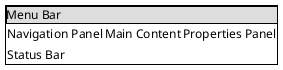

# Comprehensive Analysis Checklist

**Version:** 1.0
**Last Updated:** 2026-01-02
**Purpose:** Ensure complete documentation capturing all stakeholder perspectives

## Overview

This checklist ensures that architectural analysis captures information needed by all stakeholders: business analysts, UX designers, solution architects, enterprise architects, security/compliance teams, FDA regulators, and engineers.

## Analysis Dimensions

###  1. Technical Architecture

**What to Capture:**
- [ ] System context (C4 Context diagram)
- [ ] Container architecture (C4 Container diagram)
- [ ] Component structure (C4 Component diagram or detailed breakdown)
- [ ] Technology stack (languages, frameworks, versions)
- [ ] Build and deployment process
- [ ] Testing strategy and frameworks
- [ ] Performance characteristics
- [ ] Scalability considerations
- [ ] Integration points (APIs, services, integration patterns)
- [ ] Communication protocols (IPC, RPC, TCP/IP, HTTP, WebSockets, message queues)
- [ ] Data schemas and message formats (JSON, XML, Protocol Buffers, custom binary)

**Artifacts:**
- `technical/system-architecture.md`
- `technical/technology-stack.md`
- `technical/data-architecture.md`
- `technical/integration-points.md`
- `technical/communication-protocols.md`
- `technical/data-schemas.md`
- `technical/deployment.md`

---

### 2. Design Patterns

**What to Capture:**
- [ ] Architectural patterns (layered, plugin, microservices, etc.)
- [ ] Design patterns (factory, strategy, repository, observer, etc.)
- [ ] Domain-specific patterns
- [ ] Code organization patterns
- [ ] Testing patterns
- [ ] For each pattern: intent, implementation, code references, benefits/drawbacks

**Artifacts:**
- `patterns/README.md` (pattern index)
- `patterns/architectural/*.md` (one file per pattern)
- `patterns/design/*.md` (one file per pattern)
- `patterns/domain/*.md` (one file per pattern)

---

### 3. Business Context

**What to Capture:**
- [ ] Primary business purpose
- [ ] Target market and customers
- [ ] Business value and ROI
- [ ] Use cases (who, what, why)
  - Actors
  - Preconditions
  - Main flow
  - Alternative flows
  - Postconditions
  - Business rules
- [ ] Business processes supported
  - BPMN-style process diagrams
  - Process steps
  - Decision points
  - Handoffs
- [ ] Key performance indicators (KPIs)
- [ ] Competitive advantages

**Artifacts:**
- `business/README.md`
- `business/use-cases.md`
- `business/user-journeys.md`
- `business/business-processes.md`
- `business/value-proposition.md`

---

### 4. User Experience

**What to Capture:**
- [ ] User personas
  - Role/title
  - Goals and motivations
  - Pain points
  - Technical proficiency
  - Domain expertise
- [ ] User workflows
  - Task-based workflows
  - Happy paths
  - Error handling
  - Time to complete
- [ ] UI structure
  - Main window layout (SALT diagram)
  - Key screens/views
  - Navigation patterns
  - Component hierarchy
- [ ] Accessibility features
  - Keyboard navigation
  - Screen reader support
  - Visual accommodations
  - Compliance (WCAG, Section 508)

**Artifacts:**
- `users/README.md`
- `users/personas.md`
- `users/workflows.md`
- `users/ui-structure.md`
- `users/accessibility.md`

---

### 5. Security and Compliance

**What to Capture:**
- [ ] Authentication mechanisms
  - Methods (username/password, SSO, certificates, etc.)
  - Password policies
  - Session management
  - Multi-factor authentication
- [ ] Authorization model
  - Roles defined
  - Permissions per role
  - RBAC implementation
  - Permission enforcement points
- [ ] Data protection
  - PHI/PII handling
  - Encryption (at rest, in transit)
  - Data masking
  - Secure deletion
- [ ] Regulatory compliance
  - FDA regulations (21 CFR Part 11 if applicable)
  - HIPAA compliance
  - GDPR considerations
  - Medical device classification
- [ ] Audit logging
  - What events are logged
  - Log retention period
  - Audit trail completeness
  - Tamper-evidence

**Artifacts:**
- `security/README.md`
- `security/authentication.md`
- `security/authorization.md`
- `security/data-protection.md`
- `security/regulatory-compliance.md`
- `security/audit-logging.md`

---

### 6. Data Architecture

**What to Capture:**
- [ ] Data model
  - Domain entities
  - Entity relationships (ER diagram)
  - Key attributes
  - Constraints and invariants
- [ ] Data sources
  - Internal sources
  - External sources (APIs, files, databases)
  - Data quality and reliability
- [ ] Data flow
  - UI → ViewModel → Domain → Repository → Database
  - Field mappings at each layer
  - Validation rules
  - Transformations
  - Sequence diagrams showing data movement
- [ ] Data lifecycle
  - Creation
  - Update
  - Archival/retention policies
  - Deletion/purging
- [ ] Data volumes
  - Estimated record counts
  - Growth rates
  - Storage requirements

**Artifacts:**
- `data/README.md`
- `data/data-model.md`
- `data/data-sources.md`
- `data/data-flow.md`
- `data/data-lifecycle.md`

---

### 7. Operations and Support

**What to Capture:**
- [ ] Monitoring
  - System health checks
  - Performance metrics
  - Error rates
  - Alerting rules
- [ ] Support procedures
  - Support tiers
  - Escalation paths
  - SLA targets
- [ ] Troubleshooting
  - Common issues and solutions
  - Diagnostic procedures
  - Log locations and interpretation
- [ ] Maintenance
  - Update procedures
  - Patch management
  - Backup and restore
  - Disaster recovery

**Artifacts:**
- `operations/README.md`
- `operations/monitoring.md`
- `operations/support.md`
- `operations/troubleshooting.md`
- `operations/maintenance.md`

---

### 8. Communication Protocols and Data Schemas

**What to Capture:**
- [ ] Communication mechanisms used
  - Inter-process communication (IPC): Named pipes, memory-mapped files, sockets
  - Remote procedure calls (RPC): gRPC, WCF, custom RPC
  - Network protocols: TCP/IP, UDP, HTTP/HTTPS, WebSockets
  - Message queues: RabbitMQ, Azure Service Bus, MSMQ
  - Database connections: Connection strings, pooling
- [ ] Protocol specifications
  - Message format (binary, text, JSON, XML, Protocol Buffers)
  - Byte order (little-endian, big-endian)
  - Header structure
  - Payload structure
  - Error handling
  - Versioning strategy
- [ ] API contracts
  - REST API endpoints (routes, methods, headers)
  - Request/response schemas (JSON Schema, OpenAPI/Swagger)
  - Authentication requirements
  - Rate limiting
  - Versioning
- [ ] Data interchange formats
  - JSON schemas for API payloads
  - XML schemas (XSD)
  - Protocol Buffer definitions (.proto files)
  - Custom binary formats with structure documentation
  - CSV/file formats for data import/export
- [ ] Communication patterns
  - Request-response
  - Publish-subscribe
  - Event streaming
  - Polling vs. push
  - Batch vs. real-time
- [ ] Protocol diagrams
  - Sequence diagrams showing message exchange
  - State diagrams for protocol states
  - Timing diagrams for real-time protocols

**Artifacts:**
- `technical/communication-protocols.md`
- `technical/data-schemas.md`
- `technical/integration-points.md` (references protocols and schemas)

**Documentation Template:**

For each communication mechanism:
```markdown
## [Protocol Name]

**Type:** [IPC | RPC | HTTP | TCP/IP | WebSocket | Message Queue]
**Purpose:** [Why this protocol is used]
**Used By:** [Components that use this protocol]

### Connection Details
- **Transport:** [TCP, Named Pipe, HTTP, etc.]
- **Address/Endpoint:** [IP:Port, Pipe name, URL]
- **Authentication:** [None, API Key, Certificate, OAuth]

### Message Format
- **Encoding:** [Binary, JSON, XML, Protocol Buffers]
- **Byte Order:** [Little-endian, Big-endian, N/A for text]

### Protocol Specification
[Detailed specification with message structures]

### Sequence Diagram
[PlantUML sequence diagram showing typical message exchange]

### Example Messages
[Request/response examples or binary packet examples]

### Error Handling
[How errors are communicated and handled]

### Code References
- Protocol definition: `path/to/protocol.cs:line` (Project @ branch hash)
- Client implementation: `path/to/client.cs:line`
- Server implementation: `path/to/server.cs:line`
```

---

## Evidence Collection

### Code References

For all claims, provide:
- File path with line numbers
- Submodule reference (branch + commit hash)
- Code snippets where helpful

Example:
```markdown
The Repository pattern is implemented in `Cascade.Data.Storage/EntityRepository.cs:45-120`
(Cascade @ main `dfec8f7`)
```

### Field Mapping Tables

Document data flow with comprehensive field mapping:

| UI Field | ViewModel Property | Domain Property | Validation | Database Column | Type | Notes |
|----------|-------------------|-----------------|------------|-----------------|------|-------|
| First Name | FirstName | Patient.FirstName | Required, Max 50 | Patients.FirstName | nvarchar(50) | - |
| DOB | DateOfBirth | Patient.DateOfBirth | Required, Past | Patients.DateOfBirth | datetime2 | Used for age calc |

### UI Layouts

Capture module-level UI using SALT:



---

## Stakeholder Validation

### Business Analysts
- [ ] Use cases are clear and complete
- [ ] Business processes are documented
- [ ] Value proposition is articulated

### UX Designers
- [ ] User personas are realistic
- [ ] Workflows are documented
- [ ] UI structure is captured

### Solution Architects
- [ ] Architecture diagrams are complete
- [ ] Integration points are documented
- [ ] Technology decisions are explained

### Enterprise Architects
- [ ] Cross-project dependencies mapped
- [ ] Technology standards alignment noted
- [ ] Strategic alignment documented

### Security/Compliance
- [ ] Security mechanisms documented
- [ ] Compliance requirements addressed
- [ ] Audit capabilities described

### Engineers
- [ ] Technical details are accurate
- [ ] Code references are valid
- [ ] Patterns are correctly identified

### FDA/Regulatory
- [ ] Regulatory requirements identified
- [ ] Risk mitigation documented
- [ ] Validation evidence referenced

---

## Documentation Completeness

### Minimum Viable Documentation (MVD)

At minimum, each project must have:
- [ ] README.md (overview with TOC)
- [ ] technical/system-architecture.md (C4 diagrams)
- [ ] technical/technology-stack.md
- [ ] patterns/README.md (at least 3 patterns)
- [ ] business/use-cases.md (at least 3 use cases)
- [ ] security/README.md (security overview)
- [ ] data/data-model.md (ER diagram)

### Full Documentation

Complete documentation includes all folders and files as defined in the documentation style guide.

---

## Quality Checks

- [ ] All diagrams render correctly
- [ ] All code references are valid and include submodule version
- [ ] All links work (internal and external)
- [ ] Terminology is consistent
- [ ] No contradictions between sections
- [ ] Each README has a table of contents
- [ ] Change logs are updated
- [ ] Metadata is complete (dates, versions, status)

---

## Change Log

- 2026-01-02 v1.0: Initial comprehensive analysis checklist created
