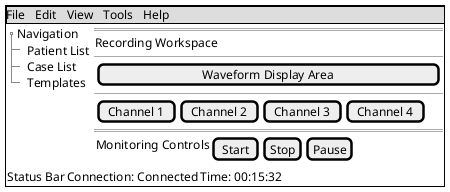
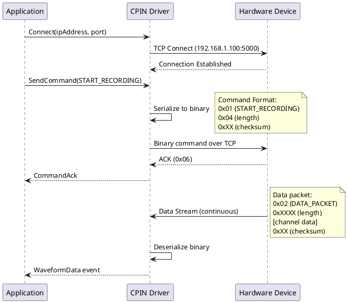
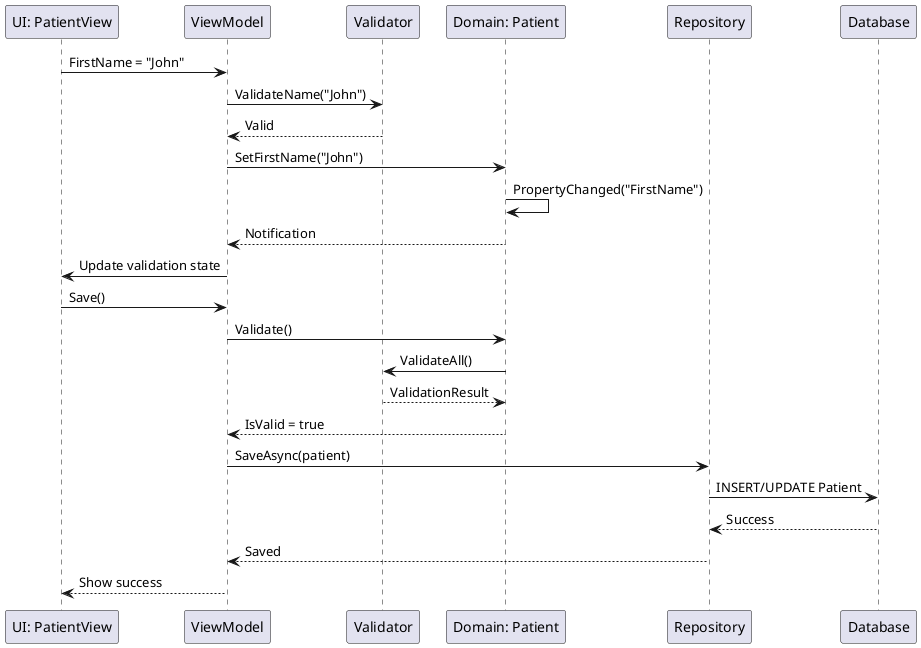
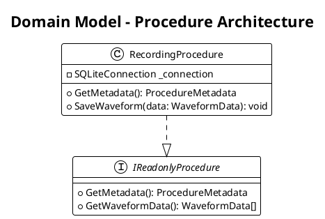
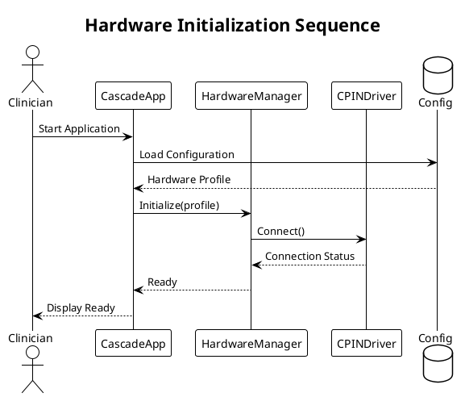
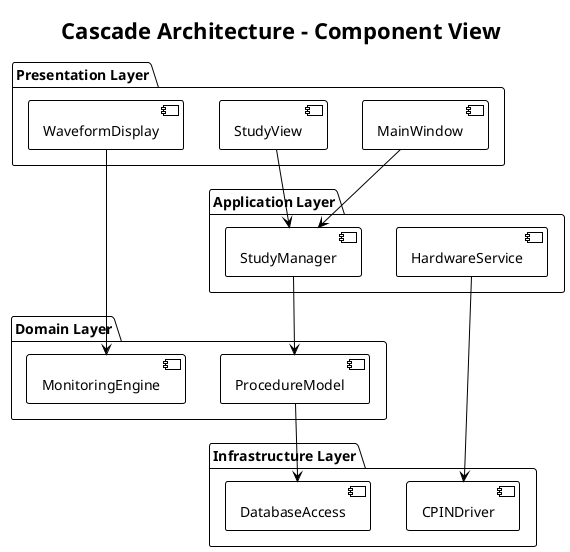

# Documentation Style Guide Protocol

**Version:** 1.2
**Last Updated:** 2026-01-02
**Purpose:** Ensure consistent documentation standards across all AllApps architectural analysis and protocols.

---

## ⚠️ CRITICAL: File Location Rules ⚠️

### NEVER Create Files Within Submodules

**ABSOLUTE RULE:** All documentation must be created in the outer AllApps project, NEVER inside submodule directories.

**Correct Locations:**
- ✅ `.\docs\Cascade\` - Documentation about Cascade (CORRECT)
- ✅ `.\docs\Arc\` - Documentation about Arc (CORRECT)
- ✅ `.\docs\shared\` - Cross-project documentation (CORRECT)
- ✅ `.\.claude\protocols\` - Protocol files (CORRECT)

**Incorrect Locations:**
- ❌ `Cascade\docs\` - Inside Cascade submodule (WRONG)
- ❌ `Arc\anything.md` - Inside Arc submodule (WRONG)
- ❌ `<SubmoduleName>\*` - Any file inside submodule (WRONG)

**Why This Matters:**
- AllApps is a documentation wrapper repository
- Submodules (Cascade/, Arc/, etc.) are independent Git repositories
- Changes to submodules must be made in their own repositories
- This repository only aggregates and documents, it does not modify submodules

**If Mistake Occurs:**
1. Immediately move files to correct location: `.\docs\<ProjectName>\`
2. Clean submodule: `cd <submodule> && git clean -fd docs/`
3. Verify: `cd <submodule> && git status` should show no changes

---

## Overview

This protocol defines the standards for all documentation created within the AllApps repository, including architectural analysis, protocols, and reference materials.

## File Organization

### Directory Structure
```
AllApps/
├── CLAUDE.md                                    # Main guidance file
├── .claude/
│   └── protocols/                               # Reusable protocols
├── docs/                                        # Architecture documentation
│   ├── <ProjectName>/                           # Per-project documentation
│   │   ├── README.md                            # Project overview and TOC
│   │   ├── technical/                           # Technical architecture
│   │   │   ├── README.md                        # Technical overview
│   │   │   ├── system-architecture.md           # C4 diagrams, containers, components
│   │   │   ├── technology-stack.md              # Technologies, frameworks, libraries
│   │   │   ├── data-architecture.md             # Data models, storage, flow
│   │   │   ├── integration-points.md            # APIs, services, external systems
│   │   │   └── deployment.md                    # Build, deployment, infrastructure
│   │   ├── patterns/                            # Design and architectural patterns
│   │   │   ├── README.md                        # Patterns overview and index
│   │   │   ├── architectural/                   # High-level patterns
│   │   │   │   ├── plugin-architecture.md
│   │   │   │   └── ...
│   │   │   ├── design/                          # Code-level patterns
│   │   │   │   ├── mvvm-pattern.md
│   │   │   │   ├── repository-pattern.md
│   │   │   │   └── ...
│   │   │   └── domain/                          # Domain-specific patterns
│   │   │       └── ...
│   │   ├── business/                            # Business perspective
│   │   │   ├── README.md                        # Business overview
│   │   │   ├── use-cases.md                     # Use cases and scenarios
│   │   │   ├── user-journeys.md                 # User workflows
│   │   │   ├── business-processes.md            # Business process flows
│   │   │   └── value-proposition.md             # Business value and ROI
│   │   ├── users/                               # User and UX perspective
│   │   │   ├── README.md                        # User overview
│   │   │   ├── personas.md                      # User personas and roles
│   │   │   ├── workflows.md                     # Task workflows
│   │   │   ├── ui-structure.md                  # UI layouts (PlantUML SALT)
│   │   │   └── accessibility.md                 # Accessibility features
│   │   ├── security/                            # Security and compliance
│   │   │   ├── README.md                        # Security overview
│   │   │   ├── authentication.md                # Auth mechanisms
│   │   │   ├── authorization.md                 # Roles, permissions, RBAC
│   │   │   ├── data-protection.md               # PHI, encryption, privacy
│   │   │   ├── regulatory-compliance.md         # FDA, HIPAA, etc.
│   │   │   └── audit-logging.md                 # Audit trail requirements
│   │   ├── data/                                # Data perspective
│   │   │   ├── README.md                        # Data overview
│   │   │   ├── data-model.md                    # Domain model, entities
│   │   │   ├── data-sources.md                  # Internal and external sources
│   │   │   ├── data-flow.md                     # Data movement and transformations
│   │   │   └── data-lifecycle.md                # Retention, archival, deletion
│   │   └── operations/                          # Operational perspective
│   │       ├── README.md                        # Operations overview
│   │       ├── monitoring.md                    # System monitoring, metrics
│   │       ├── support.md                       # Support procedures
│   │       ├── troubleshooting.md               # Common issues and solutions
│   │       └── maintenance.md                   # Maintenance procedures
│   │
│   └── shared/                                  # Cross-cutting documentation
│       ├── README.md                            # Shared docs overview
│       ├── patterns/                            # Common patterns across projects
│       │   ├── README.md                        # Pattern index
│       │   ├── architectural/
│       │   ├── design/
│       │   └── integration/
│       ├── technical/                           # Cross-project technical docs
│       │   ├── technology-matrix.md             # Technology usage across projects
│       │   ├── dependency-graph.md              # Project dependencies
│       │   └── integration-architecture.md      # How projects integrate
│       ├── business/                            # Enterprise business view
│       │   ├── ecosystem-overview.md            # Overall product ecosystem
│       │   └── value-streams.md                 # Business value streams
│       ├── security/                            # Enterprise security
│       │   ├── security-architecture.md         # Overall security approach
│       │   └── compliance-matrix.md             # Regulatory compliance mapping
│       └── data/                                # Enterprise data architecture
│           ├── data-landscape.md                # Data across all systems
│           └── master-data-management.md        # MDM strategy
```

### File Naming Conventions

- **Project directories**: Match submodule names exactly (e.g., `Arc`, `Cascade`, `CadLink`)
- **Lowercase with hyphens**: For all file and folder names (e.g., `use-cases.md`, `ui-structure.md`)
- **README.md**: Table of contents and overview for each directory
- **Descriptive names**: Files should clearly indicate content (e.g., `regulatory-compliance.md` not `compliance.md`)
- **Granular topics**: Break large topics into focused files (one pattern per file in patterns/)

## Markdown Standards

### Document Structure

Every documentation file MUST include:

```markdown
# [Document Title]

**Last Updated:** YYYY-MM-DD
**Status:** [Draft | Review | Active | Deprecated]
**Related Projects:** [Project names if applicable]
**Submodule References:** [If analyzing submodule code]
  - `<SubmoduleName>` @ `<branch>` (`<commit-hash>`)

## Overview
[Brief 2-3 sentence summary]

## [Main Content Sections]

## Related Documentation
- [Links to related docs]

## Change Log
- YYYY-MM-DD: [Change description]
```

### Heading Hierarchy

- **H1 (#)**: Document title only (one per file)
- **H2 (##)**: Major sections
- **H3 (###)**: Sub-sections
- **H4 (####)**: Fine-grained details
- **H5-H6**: Avoid; restructure if needed

### Code Examples

Use fenced code blocks with language identifiers:

```markdown
```csharp
// C# code example
public class Example { }
```

```bash
# Shell commands
git submodule update --init
```

```xml
<!-- XML examples -->
<Project Sdk="Microsoft.NET.Sdk">
```
```

### Tables

Use GitHub-flavored markdown tables with proper alignment:

```markdown
| Column 1 | Column 2 | Column 3 |
|----------|----------|----------|
| Data     | Data     | Data     |
```

Align columns appropriately:
- Left-align: Text descriptions
- Right-align: Numbers
- Center-align: Status indicators

### Lists

**Ordered lists** for sequential steps:
1. First step
2. Second step

**Unordered lists** for non-sequential items:
- Item one
- Item two

**Nested lists** with consistent indentation (2 or 4 spaces):
- Parent item
  - Child item
  - Child item

### Emphasis

- **Bold** (`**text**`): Key terms, headings, important callouts
- *Italic* (`*text*`): Subtle emphasis, variable names
- `Code` (`` `text` ``): File names, code references, commands
- ***Bold italic*** (`***text***`): Rare, only for critical warnings

### Links

- **Internal links**: Use relative paths
  ```markdown
  [Architecture Analysis](./architecture/analysis/Cascade/README.md)
  ```

- **External links**: Include descriptive text
  ```markdown
  [Azure DevOps Wiki](https://dev.azure.com/Cadwell/Engr/_wiki)
  ```

- **Code references**: Use format `file_path:line_number`
  ```markdown
  See `Cascade/src/Studio/MainWindow.xaml.cs:245`
  ```

- **Submodule code references**: Include branch and commit hash
  ```markdown
  See `Cascade/src/Studio/MainWindow.xaml.cs:245` (Cascade @ main `a1b2c3d`)
  ```

### Submodule Versioning

When documenting information from a submodule, ALWAYS include:

1. **In document metadata**: Submodule name, branch, and commit hash
   ```markdown
   **Submodule References:**
     - `Cascade` @ `main` (`a1b2c3d4e5f6a1b2c3d4e5f6a1b2c3d4e5f6a1b2`)
     - `Core` @ `develop` (`b2c3d4e5f6a1b2c3d4e5f6a1b2c3d4e5f6a1b2c3`)
   ```

2. **In inline references**: Abbreviated hash for readability
   ```markdown
   The `IReadonlyProcedure` interface (Core @ main `b2c3d4e`) defines...
   ```

3. **Retrieving submodule information**:
   ```bash
   # Get current commit hash
   cd <submodule-name>
   git rev-parse HEAD

   # Get current branch
   git rev-parse --abbrev-ref HEAD

   # Get short hash (7 characters)
   git rev-parse --short HEAD
   ```

4. **Format for tables**:
   | Submodule | Branch | Commit | Date |
   |-----------|--------|--------|------|
   | Cascade | main | `a1b2c3d` | 2026-01-02 |
   | Core | develop | `b2c3d4e` | 2026-01-01 |

## PlantUML Diagram Standards

### General Guidelines

1. **Embedding**: Always embed PlantUML directly in markdown files using fenced code blocks
   ````markdown
   ```plantuml
   @startuml
   ' Your diagram here
   @enduml
   ```
   ````

2. **NO separate .puml files**: Diagrams live in the same markdown file as their documentation
3. **Versioning**: Include version, date, and submodule reference as comments in diagram
4. **Consistent styling**: Use defined color schemes
5. **Multiple diagrams**: Use descriptive comments to separate diagrams in the same file

### Embedding Example

````markdown
# System Architecture

## Context Diagram

```plantuml
@startuml
'title: C4 Context Diagram - Cascade
'version: 1.0
'date: 2026-01-02
'submodule: Cascade @ main (a1b2c3d)

!include https://raw.githubusercontent.com/plantuml-stdlib/C4-PlantUML/master/C4_Context.puml
' Diagram content here
@enduml
```

## Container Diagram

```plantuml
@startuml
'title: C4 Container Diagram - Cascade
'version: 1.0
'date: 2026-01-02
'submodule: Cascade @ main (a1b2c3d)

!include https://raw.githubusercontent.com/plantuml-stdlib/C4-PlantUML/master/C4_Container.puml
' Diagram content here
@enduml
```
````

### UI Layout Diagrams (PlantUML SALT)

Use PlantUML SALT for module/component level UI layouts. Keep diagrams at a conceptual level, not pixel-perfect mockups.

**Guidelines:**
- Focus on layout structure and key components
- Show interaction flows, not detailed styling
- Label major UI areas and controls
- Use for module-level UI, not full-screen details
- Include state transitions where relevant

**Example SALT Diagram:**

````markdown
## Main Window Structure


````

**ASCII Art Alternative:**

For simple layouts, ASCII art is acceptable:

```
+--------------------------------------------------+
| Menu Bar: File | Edit | View | Tools | Help     |
+----------+---------------------------------------+
| Tree     | Main Content Area                    |
| Nav      |                                      |
|  - Item1 | +----------------------------------+ |
|  - Item2 | | Component Display                | |
|  - Item3 | |                                  | |
|          | +----------------------------------+ |
+----------+---------------------------------------+
| Status Bar: Connected | User: John | Time: 10:15 |
+--------------------------------------------------+
```

### Communication Protocol Diagrams

Document communication mechanisms and protocols using sequence diagrams and protocol specifications.

**Example Communication Flow:**

````markdown
## Hardware Communication Protocol

### Protocol Type: TCP/IP with Custom Binary Protocol



### Protocol Specification

**Transport:** TCP/IP
**Port:** 5000 (default, configurable)
**Encoding:** Binary (custom protocol)
**Byte Order:** Little-endian

**Message Structure:**
| Offset | Size | Field | Description |
|--------|------|-------|-------------|
| 0 | 1 byte | Command | Command identifier (0x01-0xFF) |
| 1 | 2 bytes | Length | Payload length |
| 3 | N bytes | Payload | Command-specific data |
| 3+N | 1 byte | Checksum | XOR of all bytes |

**Commands:**
- `0x01`: START_RECORDING
- `0x02`: STOP_RECORDING
- `0x03`: GET_STATUS
- `0x10`: DATA_PACKET (device → application)
````

### Data Schema Documentation

Document all message formats, API contracts, and data interchange schemas.

**JSON Schema Example:**

````markdown
## Patient API - Create Patient Request

### Endpoint
```
POST /api/patients
Content-Type: application/json
```

### Request Schema

```json
{
  "$schema": "http://json-schema.org/draft-07/schema#",
  "type": "object",
  "required": ["firstName", "lastName", "dateOfBirth"],
  "properties": {
    "firstName": {
      "type": "string",
      "minLength": 1,
      "maxLength": 50,
      "description": "Patient's first name"
    },
    "lastName": {
      "type": "string",
      "minLength": 1,
      "maxLength": 50,
      "description": "Patient's last name"
    },
    "dateOfBirth": {
      "type": "string",
      "format": "date",
      "description": "Patient's date of birth (YYYY-MM-DD)"
    },
    "medicalRecordNumber": {
      "type": "string",
      "pattern": "^[A-Z0-9]{6,20}$",
      "description": "Optional MRN"
    }
  }
}
```

### Example Request
```json
{
  "firstName": "John",
  "lastName": "Doe",
  "dateOfBirth": "1980-05-15",
  "medicalRecordNumber": "MRN123456"
}
```

### Response Schema (Success - 201 Created)
```json
{
  "type": "object",
  "properties": {
    "id": {
      "type": "string",
      "format": "uuid",
      "description": "Generated patient ID"
    },
    "firstName": { "type": "string" },
    "lastName": { "type": "string" },
    "dateOfBirth": { "type": "string", "format": "date" },
    "medicalRecordNumber": { "type": "string" },
    "createdAt": {
      "type": "string",
      "format": "date-time"
    }
  }
}
```

### Error Response (400 Bad Request)
```json
{
  "type": "object",
  "properties": {
    "error": {
      "type": "string",
      "description": "Error message"
    },
    "validationErrors": {
      "type": "array",
      "items": {
        "type": "object",
        "properties": {
          "field": { "type": "string" },
          "message": { "type": "string" }
        }
      }
    }
  }
}
```
````

**Binary Protocol Example:**

````markdown
## Waveform Data Protocol

### Protocol: Custom Binary over Named Pipes (IPC)

### Pipe Name
```
\\.\pipe\CascadeWaveformData
```

### Message Format

**Header (12 bytes):**
| Offset | Size | Type | Field | Description |
|--------|------|------|-------|-------------|
| 0 | 4 | uint32 | MagicNumber | 0x43574456 ("CWDV") |
| 4 | 2 | uint16 | Version | Protocol version (currently 1) |
| 6 | 2 | uint16 | MessageType | See message types below |
| 8 | 4 | uint32 | PayloadLength | Length of payload in bytes |

**Message Types:**
- `0x0001`: Waveform data
- `0x0002`: Event marker
- `0x0003`: Configuration change
- `0x0004`: Heartbeat

**Waveform Data Payload:**
| Offset | Size | Type | Field | Description |
|--------|------|------|-------|-------------|
| 0 | 8 | int64 | Timestamp | Microseconds since epoch |
| 8 | 2 | uint16 | ChannelCount | Number of channels in packet |
| 10 | 2 | uint16 | SamplesPerChannel | Samples per channel |
| 12 | N*2 | int16[] | Samples | Interleaved channel data |

**Example (C# Structure):**
```csharp
[StructLayout(LayoutKind.Sequential, Pack = 1)]
public struct WaveformDataHeader
{
    public uint MagicNumber;      // 0x43574456
    public ushort Version;         // 1
    public ushort MessageType;     // 0x0001
    public uint PayloadLength;     // Variable
}

[StructLayout(LayoutKind.Sequential, Pack = 1)]
public struct WaveformDataPayload
{
    public long Timestamp;
    public ushort ChannelCount;
    public ushort SamplesPerChannel;
    // Followed by int16[ChannelCount * SamplesPerChannel]
}
```
````

### Data Flow and Field Mapping Diagrams

Document data flow from UI input through validation to database persistence using sequence or flow diagrams.

**Example Data Flow:**

````markdown
## Patient Data Entry Flow



### Field Mapping Table

| UI Field | ViewModel Property | Domain Entity | Validation Rules | Database Column | Type |
|----------|-------------------|---------------|------------------|-----------------|------|
| First Name | FirstName | Patient.FirstName | Required, Max 50 chars | Patients.FirstName | nvarchar(50) |
| Last Name | LastName | Patient.LastName | Required, Max 50 chars | Patients.LastName | nvarchar(50) |
| DOB | DateOfBirth | Patient.DateOfBirth | Required, Must be past date | Patients.DateOfBirth | datetime2 |
````

### C4 Model Diagrams

Use C4-PlantUML library for consistency:

```plantuml
@startuml c4-context-diagram
!include https://raw.githubusercontent.com/plantuml-stdlib/C4-PlantUML/master/C4_Context.puml

'Metadata
title System Context Diagram - Cadwell Medical Device Ecosystem
LAYOUT_WITH_LEGEND()

'Define elements
Person(clinician, "Clinician", "Operating room staff, sleep technicians")
System(cascade, "Cascade", "Surgical studio for IONM")
System(hypnos, "Hypnos", "Sleep medicine recording")
System_Ext(cadlink, "CadLink", "Data management platform")

'Define relationships
Rel(clinician, cascade, "Monitors patient", "Real-time waveforms")
Rel(cascade, cadlink, "Stores case data", "SQLite/SQL Server")

@enduml
```

#### C4 Levels

1. **Context Diagram** (`c4-context-*.puml`): System landscape, external dependencies
2. **Container Diagram** (`c4-container-*.puml`): Applications, data stores, microservices
3. **Component Diagram** (`c4-component-*.puml`): Major components within a container
4. **Code Diagram**: Use UML class diagrams instead

### UML Diagrams

#### Class Diagrams



#### Sequence Diagrams



#### Component Diagrams



### Diagram Styling

Define consistent colors:

```plantuml
' Medical Device Software Color Scheme
!define CASCADE_BLUE #4A90E2
!define ARC_GREEN #7ED321
!define HYPNOS_PURPLE #9013FE
!define CADLINK_ORANGE #F5A623
!define CORE_GRAY #8B8B8B
!define EXTERNAL_LIGHTGRAY #D3D3D3
```

## Comprehensive Documentation Standards

### Project Documentation Structure

Each project MUST have organized, stakeholder-specific documentation:

#### 1. Project Overview (README.md)
- Purpose, domain, and scope
- Quick-start guide for different audiences
- Table of contents linking to all documentation
- Key contacts and team information

#### 2. Technical Documentation (`technical/`)
- **system-architecture.md**: C4 Context/Container diagrams, component structure
- **technology-stack.md**: Languages, frameworks, libraries with versions
- **data-architecture.md**: Data models, schemas, storage mechanisms
- **integration-points.md**: APIs, services, integration patterns
- **communication-protocols.md**: IPC, RPC, TCP/IP, HTTP, WebSockets, message queues
- **data-schemas.md**: Message formats, API contracts, data interchange formats (JSON, XML, Protocol Buffers)
- **deployment.md**: Build process, environments, deployment procedures

#### 3. Patterns Documentation (`patterns/`)
- **README.md**: Pattern index and overview
- **architectural/**: High-level architectural patterns (one per file)
- **design/**: Code-level design patterns (one per file)
- **domain/**: Domain-specific patterns (one per file)

Each pattern file should include:
- Intent and problem solved
- Implementation with code references
- Benefits and drawbacks
- Related patterns

#### 4. Business Documentation (`business/`)
- **use-cases.md**: Detailed use case scenarios
- **user-journeys.md**: User workflows and journeys
- **business-processes.md**: Business process flows (BPMN-style diagrams)
- **value-proposition.md**: Business value, ROI, market positioning

#### 5. User Documentation (`users/`)
- **personas.md**: User roles and personas
- **workflows.md**: Task-based workflows
- **ui-structure.md**: UI layouts using PlantUML SALT or ASCII
- **accessibility.md**: Accessibility features and compliance

#### 6. Security Documentation (`security/`)
- **authentication.md**: How users authenticate
- **authorization.md**: Roles, permissions, RBAC model
- **data-protection.md**: PHI handling, encryption, privacy
- **regulatory-compliance.md**: FDA, HIPAA, 21 CFR Part 11
- **audit-logging.md**: What's logged, retention, audit trails

#### 7. Data Documentation (`data/`)
- **data-model.md**: Domain entities, relationships (ER diagrams)
- **data-sources.md**: Internal and external data sources
- **data-flow.md**: Data movement, transformations, field mappings
- **data-lifecycle.md**: Retention policies, archival, deletion

#### 8. Operations Documentation (`operations/`)
- **monitoring.md**: System health, metrics, alerting
- **support.md**: Support procedures, escalation
- **troubleshooting.md**: Common issues and resolutions
- **maintenance.md**: Routine maintenance, updates, patches

### Documentation Requirements by Audience

**For Business Analysts:**
- Use cases with pre/post conditions
- Business process flows
- User journeys
- Data sources and reports

**For UX Designers:**
- User personas
- UI structure (SALT diagrams)
- Workflows
- Accessibility requirements

**For Solution Architects:**
- C4 diagrams (Context, Container, Component)
- Integration points
- Technology decisions
- Patterns used

**For Enterprise Architects:**
- Cross-project dependencies
- Technology standards alignment
- Data architecture
- Compliance and governance

**For Security/Compliance:**
- Authentication and authorization
- Data protection mechanisms
- Regulatory compliance evidence
- Audit logging

**For Embedded/Application Engineers:**
- Technical architecture
- Code patterns
- Build and deployment
- Integration APIs

**For FDA/Regulatory:**
- Regulatory compliance documentation
- Risk management
- Validation evidence
- Change control

### Pattern Documentation Format

```markdown
## Pattern Name: [Descriptive Name]

**Category:** [Architectural | Design | Code Organization | Testing]
**Used In:** [Project names]
**Confidence:** [High | Medium | Low]

### Intent
[What problem does this solve?]

### Implementation
[How is it implemented in this codebase?]

### Example
```language
[Code example]
```

### Benefits
- [Benefit 1]
- [Benefit 2]

### Drawbacks
- [Drawback 1]

### Related Patterns
- [Pattern name]
```

## Protocol Standards

### Protocol Document Structure

```markdown
# [Protocol Name] Protocol

**Version:** X.Y
**Last Updated:** YYYY-MM-DD
**Purpose:** [Single sentence purpose]

## Overview
[2-3 sentences describing the protocol]

## When to Use
- [Scenario 1]
- [Scenario 2]

## Prerequisites
- [Requirement 1]

## Procedure

### Step 1: [Step Name]
[Detailed instructions]

```language
[Code or command examples]
```

**Validation:**
- [ ] [Check 1]
- [ ] [Check 2]

### Step 2: [Step Name]
[Continue...]

## Validation Checklist
- [ ] [Overall validation point 1]
- [ ] [Overall validation point 2]

## Common Issues
| Issue | Cause | Resolution |
|-------|-------|------------|
| [Issue] | [Cause] | [How to fix] |

## Related Protocols
- [Protocol name]

## Change Log
- YYYY-MM-DD v1.0: Initial version
```

### Protocol Versioning

- **Major version (X.0)**: Breaking changes to procedure
- **Minor version (X.Y)**: Additions or clarifications
- Use semantic versioning

### Protocol Validation

Every protocol MUST include:
1. **Validation checklist**: Verifiable success criteria
2. **Common issues table**: Known problems and solutions
3. **Prerequisites**: What must be true before starting

## Writing Style Guidelines

### Voice and Tone

- **Active voice**: Preferred
  - ✅ "The system processes waveforms"
  - ❌ "Waveforms are processed by the system"

- **Present tense**: For describing current state
  - ✅ "Cascade uses WPF for UI"
  - ❌ "Cascade used WPF for UI"

- **Imperative mood**: For instructions
  - ✅ "Run the build command"
  - ❌ "You should run the build command"

### Terminology

**Consistent terms** across documentation:

| Use | Don't Use | Context |
|-----|-----------|---------|
| Submodule | Sub-module, module | Git submodules |
| Medical device software | App, program | Regulatory context |
| IONM | Neuromonitoring, IOM | Intraoperative neuromonitoring |
| C4 model | C4 diagram style | Architecture diagrams |
| Protocol | Procedure, guide | Reusable processes |
| Pattern | Best practice, approach | Design patterns |

**Project-specific terminology**: Reference each project's existing documentation

### Clarity and Precision

- **Be specific**:
  - ✅ "Cascade.sln contains 47 projects"
  - ❌ "Cascade has many projects"

- **Use examples**:
  - ✅ "Monitoring modes include SSEP, MEP, and EMG"
  - ❌ "Various monitoring modes are supported"

- **Avoid jargon** unless domain-specific:
  - ✅ "SSEP (Somatosensory Evoked Potential)"
  - ❌ "Utilizes advanced neurophysiological modalities"

### Acronyms and Abbreviations

**First use**: Spell out with acronym in parentheses
- "Intraoperative Neuromonitoring (IONM)"
- "Windows Presentation Foundation (WPF)"

**Subsequent uses**: Acronym only
- "IONM provides real-time feedback"

**Common acronyms** (no explanation needed):
- API, UI, SQL, JSON, XML, HTTP, URL, Git
- FDA (in medical device context)
- C# (programming language)

## Validation and Quality

### Pre-Publish Checklist

Before committing documentation:

- [ ] Document follows structure guidelines
- [ ] All PlantUML diagrams render correctly
- [ ] All links work (internal and external)
- [ ] Code examples are syntactically correct
- [ ] Terminology is consistent
- [ ] Metadata is complete (dates, status, etc.)
- [ ] Change log is updated
- [ ] Related documentation is linked

### Review Process

**Self-review questions:**
1. Can someone unfamiliar with the project understand this?
2. Are all diagrams necessary and clear?
3. Is the information accurate and up-to-date?
4. Are there any missing pieces?
5. Is this the right level of detail?

## Tools and Rendering

### PlantUML Rendering

Test diagrams with:
- [PlantUML Online Server](http://www.plantuml.com/plantuml/)
- VS Code PlantUML extension
- IntelliJ PlantUML integration

### Markdown Linting

Use markdownlint or similar tools to enforce:
- Consistent heading styles
- Proper list formatting
- Line length limits (120 characters recommended)
- No trailing whitespace

## Tools and Scripting Standards

### Programming Languages for Tools

**CRITICAL: Python is NOT available**
- Use **.NET (C#)** for utilities and tools
- Use **Node.js** for JavaScript-based tools
- Never use Python - it will fail

### Script Preferences

**Windows Environment:**
- **Preferred**: PowerShell (.ps1)
- **Acceptable**: Batch files (.bat)
- **Avoid**: Bash scripts (not native to Windows)

**Script Locations:**
```
AllApps/
├── tools/                    # Compiled tools and utilities
│   └── {toolname}/          # Each tool in its own directory
│       ├── Program.cs       # .NET tool
│       └── package.json     # Or Node.js tool
└── scripts/                 # Scripts
    ├── analyze-project.ps1  # PowerShell scripts
    └── build-docs.bat       # Batch files
```

### Example Tool Structure

**.NET Tool:**
```
tools/doc-validator/
├── DocValidator.csproj
├── Program.cs
└── README.md
```

**Node.js Tool:**
```
tools/diagram-renderer/
├── package.json
├── index.js
└── README.md
```

## Work Tracking Standards

### Root-Level TODO (.\TODO.md)

Track all ongoing work in root `TODO.md`:

```markdown
# AllApps Work Tracking

**Last Updated:** YYYY-MM-DD

## In Progress
- [ ] Cascade documentation (29/49 files complete)
  - [x] Technical documentation
  - [x] Patterns documentation
  - [ ] Users documentation
  - [ ] Security documentation
  - [ ] Data documentation
  - [ ] Operations documentation

## Planned
- [ ] Arc architectural analysis
- [ ] Hypnos architectural analysis

## Completed
- [x] Documentation framework established
- [x] Cascade technical analysis
```

### Change History (.\docs\changes\{project}\{area}-{topic}.md)

Document all significant changes:

**Structure:**
```
docs/changes/
├── Cascade/
│   ├── technical-architecture.md
│   ├── patterns-mvvm.md
│   └── security-compliance.md
├── Arc/
│   └── technical-architecture.md
└── shared/
    └── common-patterns.md
```

**Format:**
```markdown
# Change History: Cascade - Technical Architecture

## 2026-01-02: Initial Documentation
**Changed By:** Claude Code
**Reason:** Comprehensive architectural documentation project

### Changes
- Created C4 Context diagram
- Created C4 Container diagram
- Documented 5 architectural decisions
- Added deployment architecture section

### Impact
- Provides foundation for developer onboarding
- Supports architectural reviews
- Enables regulatory documentation
```

## Mandatory Documentation Elements

### Every Document Must Include

1. **Table of Contents** (for documents >100 lines)
   ```markdown
   ## Table of Contents
   - [Overview](#overview)
   - [Section 1](#section-1)
   - [Section 2](#section-2)
   ```

2. **Submodule Reference** (when referencing code)
   ```markdown
   **Submodule Reference:** `Cascade` @ `master` (`dfec8f78`)
   ```

3. **Source Code Links**
   ```markdown
   See [PluginManager.cs](../../Cascade/src/Core/PluginManager.cs:45-120)
   (Cascade @ master `dfec8f78`)
   ```

4. **Last Updated Date**
   ```markdown
   **Last Updated:** 2026-01-02
   ```

5. **Change Log** (at document end)
   ```markdown
   ## Change Log
   - 2026-01-02 v1.0: Initial documentation created
   - 2026-01-15 v1.1: Added deployment section
   ```

### Specialized Documentation Requirements

#### Glossary (glossary.md per project)

Every project MUST have a glossary with:
- Medical/clinical terms
- Technical terms
- Business terms
- Acronyms and abbreviations
- Domain-specific conventions

See `docs/Cascade/glossary.md` for template.

#### UI Pattern Documentation

In `users/ui-structure.md`, document:

1. **UI Pattern Used** (MVVM, MVC, code-behind, etc.)
2. **Binding Mappings**:
   ```markdown
   | UI Element | ViewModel Property | Domain Property | Validation | Database Column |
   |------------|-------------------|-----------------|------------|-----------------|
   | FirstNameTextBox | FirstName | Patient.FirstName | Required, Max 50 | Patients.FirstName |
   ```

3. **Validation Implementation**
   - INotifyDataErrorInfo usage
   - Validation rules
   - Error display

4. **SALT Diagrams** for UI layouts

#### System Diagrams Required

Every project MUST include:

1. **Deployment Diagram** - Physical/logical deployment architecture
2. **ER Diagram** - Entity relationships in data model
3. **Data Flow Diagram** - UI → ViewModel → Domain → Database
4. **C4 Context Diagram** - System context and external dependencies
5. **C4 Container Diagram** - Major application containers

All embedded as PlantUML in markdown.

## Source Code Reference Format

**Standard Format:**
```markdown
[FileName.cs](../../ProjectName/path/to/file.cs:line-range) (ProjectName @ branch `hash`)
```

**Examples:**
```markdown
Plugin discovery: [PluginManager.cs](../../Cascade/src/Core/PluginManager.cs:45-120) (Cascade @ master `dfec8f78`)

MVVM implementation: [StudyViewModel.cs](../../Cascade/src/UI/ViewModels/StudyViewModel.cs:30-85) (Cascade @ master `dfec8f78`)
```

**Include:**
- Relative path from documentation file
- Line numbers for specific sections (optional but recommended)
- Submodule name
- Branch name
- Short commit hash (7 chars)

## CRITICAL: No Unverified Claims Rule

### Validation Rule: All Statements Must Be Sourced

**ABSOLUTE REQUIREMENT:** No data points, claims, or statements may be included without a verifiable source.

**Prohibited Without Source:**
- ❌ ROI calculations (return multiples, payback periods)
- ❌ Cost savings estimates
- ❌ Time savings estimates
- ❌ Performance metrics not from code/docs
- ❌ User satisfaction claims
- ❌ Market share data
- ❌ Competitive advantages (unless documented)
- ❌ Business process times (unless observed/documented)
- ❌ Workflow durations (unless measured)

**Required Source Types:**
1. **Code references**: Link to actual source code
2. **Existing documentation**: Link to official docs in submodule
3. **Configuration files**: Reference actual config
4. **Database schemas**: From actual DDL or EF models
5. **Meeting notes**: With date and attendees
6. **User research**: With methodology and date
7. **Analytics data**: With date range and tool
8. **Vendor documentation**: With version and URL

**Source Citation Format:**

```markdown
The case setup workflow takes 10-15 minutes.
**Source:** [User observation study, 2024-06-15, 20 cases observed](../../Cascade/docs/research/workflow-study-2024-06.md)

The system processes 1000 samples/second per channel.
**Source:** [HardwareService.cs:245](../../Cascade/src/Services/HardwareService.cs:245) - ProcessSamples method (Cascade @ master `dfec8f78`)

HIPAA compliance is required for all patient data.
**Source:** [HIPAA Security Rule 45 CFR §164.308](https://www.hhs.gov/hipaa/for-professionals/security/index.html)
```

**For Business/User Flows:**

Every workflow, process, or user journey MUST include:

```markdown
## Patient Case Setup Workflow

**Process Source:** [Workflow observation at Memorial Hospital OR, 2024-03-15, shadowed 3 IONs]
**Documented By:** [Name]
**Last Verified:** 2024-03-15
**Validation:** Reviewed by 2 IONs, confirmed accurate

[Workflow details here...]
```

**If No Source Exists:**

Use these approaches:
1. **Mark as hypothetical**: "**Note:** This workflow is reconstructed from code analysis and has not been validated with actual users."
2. **Mark as assumed**: "**Assumption:** Based on code structure, this appears to be the workflow. Requires user validation."
3. **Leave blank**: If no source exists and it's important, leave section as "**TO BE DOCUMENTED**" rather than making up data

### Validation Checklist

Before publishing any document, verify:

- [ ] Every claim has a source citation
- [ ] No ROI/cost data unless from official business case documents
- [ ] No performance numbers unless from code, tests, or monitoring data
- [ ] No workflow times unless from actual observations or studies
- [ ] All "Source:" citations are verifiable
- [ ] Hypothetical/assumed content is clearly marked
- [ ] Business value claims reference official materials

### Review Process

**Red Flags Requiring Immediate Source:**
- Any dollar amounts ($)
- Any percentages (%) related to business value
- Any time estimates (hours, minutes) for user tasks
- Any "X times faster/better/cheaper" claims
- Any market/competitive positioning statements
- Any user satisfaction scores

**Acceptable Without External Source:**
- Architecture from code analysis (with code links)
- Technology stack from project files
- Database schema from migrations/models
- API contracts from actual code
- Protocol specifications from code
- System behavior from code analysis

## Change Log

- 2026-01-02 v1.2: **CRITICAL** - Added no unverified claims validation rule
- 2026-01-02 v1.1: Added tools/scripting standards, work tracking, mandatory elements
- 2026-01-02 v1.0: Initial style guide protocol created

## Related Protocols

- [Architectural Analysis Protocol](./architectural-analysis.md)
- [Submodule Review Protocol](./submodule-review.md)
- [Protocol Validation Protocol](./protocol-validation.md)
